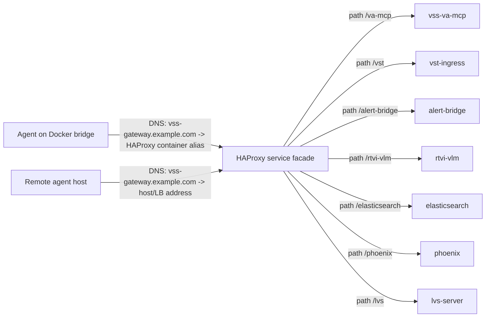

<!--
SPDX-FileCopyrightText: Copyright (c) 2026 NVIDIA CORPORATION & AFFILIATES. All rights reserved.
SPDX-License-Identifier: Apache-2.0
-->

# Docker Service Location Indirection — Software Requirements Document (SRD)

## About this copy

This is the in-repository copy of the SRD that the VIA-2713 gateway work
implements. The ODT the requirements were reviewed in records
`docs/docker-service-location-indirection-srd.md` as the file it was generated
from, and that file did not exist; this is it.

| | |
|---|---|
| **Source document** | `Docker-Service-Location-Indirection-SRD (1).odt` |
| **Source revision date** | 2026-09-09T13:00:00Z (`meta:editing-cycles` 4) |
| **Document Version (as stated in the body)** | 0.1 |
| **Date (as stated in the body)** | 2026-08-05 |
| **Status (as stated in the body)** | Draft - For Review |
| **Author** | Kaushik Chandrashekar |
| **`dc:creator` of the source file** | Zac Wang |
| **`meta:initial-creator`** | Codex |

Two copies of the ODT were in circulation and they differ. The September one
above is authoritative and is what this file reproduces; the earlier copy is
dated 2026-08-25T17:01:00Z (`meta:editing-cycles` 3). The September revision
made exactly four changes, all in FR-15: the gateway paths for VST ingress,
Alert Bridge and the LVS backend were renamed to `/vios`, `/alerts` and
`/video-summarization`, accepting three review comments, and a new `/llm/` row
was added. Nothing else in the document changed.

**Reviewer margin comments are reproduced**, inline and attributed, as

> **[Margin — Name, date]** …

They carry decisions that are not in the body text, so dropping them would lose
the reasoning behind several requirements. They are the reviewers' words, not
the document's.

### Editorial note — internal inconsistencies, reproduced rather than fixed

The September revision renamed three route prefixes in FR-15 **and nowhere
else**. The rest of the document still uses the old prefixes. This conversion
**reproduces the document as it stands**; the divergence is listed here so it
is visible rather than quietly harmonised. None of it has been corrected below.

| Where | Says | FR-15 now says |
|---|---|---|
| FR-20 (`ALERT_BRIDGE_URL` example) | `/alert-bridge` | `/alerts` |
| FR-20 (`LVS_BACKEND_URL` example) | `/lvs` | `/video-summarization` |
| FR-20 (`VST_INTERNAL_URL` example) | `/vst` | `/vios` |
| FR-22 (example env file) | `/alert-bridge`, `/lvs` | `/alerts`, `/video-summarization` |
| §4.1 (flowchart edges) | `/vst`, `/alert-bridge`, `/lvs` | `/vios`, `/alerts`, `/video-summarization` |
| §4.3 (example gateway env file) | `/alert-bridge`, `/lvs` | `/alerts`, `/video-summarization` |
| §4.4 (endpoint contract table) | `/vst`, `/lvs` | `/vios`, `/video-summarization` |
| Appendix A.2 (`vss-gateway.env`) | `/alert-bridge`, `/lvs` | `/alerts`, `/video-summarization` |
| Appendix A.3 (local HTTP variant) | `/alert-bridge`, `/lvs` | `/alerts`, `/video-summarization` |
| Appendix B (route validation checklist) | `/alert-bridge`, `/lvs`, `/vst` | `/alerts`, `/video-summarization`, `/vios` |

Two further loose ends in the same revision, also left as they are:

- The new FR-15 `/llm/` row is the only one whose **Backend port** and **Notes**
  cells are empty, and the only mount written with a trailing slash (`/llm/`
  rather than `/llm`). Its margin comment marks it as not yet reviewed.
- FR-15's three renames were made by accepting review comments that are still
  attached to the rows, so the questions read as open even though the change
  they asked for was applied.

For what the implementation actually does with these prefixes — both spellings
route, and the old ones carry `Deprecation` headers through a soak period — see
`deploy/docker/README.md`. That is a statement about the code, not a correction
to this document.

---

## Document Metadata

| Field | Value |
|---|---|
| Document Version | 0.1 |
| Date | 2026-08-05 |
| Status | Draft - For Review |
| Author | Kaushik Chandrashekar |
| Contributors | Kaushik Chandrashekar |
| Team | VSS Metropolis |

## Reviewers and Approvers

| Name | Role | Team | Signature / Date |
|---|---|---|---|
| TBD | Deployment DRI | VSS Metropolis | |
| TBD | Agent DRI | VSS Metropolis | |
| TBD | Infrastructure / HAProxy DRI | VSS Metropolis | |
| TBD | Security Reviewer | VSS Metropolis | |
| TBD | Release Approver | VSS Metropolis | |

---

## 1. Introduction

### 1.1 Purpose

This document specifies the requirements for decoupling VSS Docker
service-to-service connectivity from Docker bridge network placement. The
immediate driver is the ability to run selected services, especially the VSS
agent, on a separate host while preserving the same downstream service
configuration contract used when the agent is colocated with the rest of the
Docker Compose deployment.

The solution must allow native Docker and Docker Compose usage. It must not
require a deployment helper script or generated environment file. Operators
shall be able to deploy the colocated stack or a remote agent with ordinary
Docker commands, environment files, Compose files, and Compose override files.

### 1.2 Background

The current Docker deployment uses Docker Compose service names for many
internal calls. This works when all containers are attached to the same Docker
bridge network because Docker's embedded DNS resolves service names such as
`vst-ingress`, `rtvi-vlm`, `vss-va-mcp`, `alert-bridge`, `elasticsearch`, and
`phoenix`.

This model breaks when a service is moved outside the Docker bridge, because
Docker service names are not resolvable or routable from a different host. In
that deployment mode, calls from the remote service to downstream VSS services
must cross a host-level or network-level ingress. The existing Docker deployment
already includes an HAProxy ingress service that maps stable HTTP paths to
backend services. This SRD formalizes HAProxy as the service access facade and
DNS as the location indirection mechanism.

### 1.3 Problem Statement

VSS services should not need to know whether their downstream dependencies are
on the same Docker bridge network or on a different host. The same logical
endpoint contract should work for:

- A fully colocated Docker Compose deployment.
- A remote VSS agent deployed on another Docker host.
- A mixed deployment where future HTTP-based services are split across hosts.

The deployment should avoid per-service URL rewrites whenever a service changes
placement. Location awareness should live in DNS and gateway routing, not inside
service configuration.

### 1.4 Scope

This SRD covers requirements for:

- A canonical service gateway origin for HTTP and WebSocket downstream calls.
- Split-horizon DNS behavior for colocated and remote callers.
- Docker network aliases that let Docker bridge DNS resolve the canonical
  gateway hostname.
- External DNS records that let off-host callers resolve the same canonical
  gateway hostname.
- HAProxy routes and path rewrites for downstream HTTP services.
- Environment-variable endpoint contracts for the VSS agent and related
  agent-side configs.
- Native Docker Compose deployment examples using `--env-file` and `-f` override
  files.
- Acceptance criteria and validation steps for colocated and remote-agent
  deployments.

### 1.5 Out-of-Scope Summary

The following areas are explicitly out of scope and are listed in more detail in
Section 8:

- Requiring or designing changes around a deployment helper script.
- Kubernetes or Helm implementation details, except as architectural reference.
- General service mesh adoption.
- HTTP path proxying for non-HTTP protocols such as Kafka broker traffic, Redis,
  TURN, RTSP, or raw TCP protocols.
- Productizing remote-agent security policy beyond the gateway requirements
  listed in this document.

### 1.6 Definitions

| Term | Definition |
|---|---|
| Colocated deployment | A deployment where the agent and downstream services share the same Docker Compose bridge network. |
| Remote agent deployment | A deployment where the VSS agent runs on a different host or Docker bridge from downstream services. |
| Gateway origin | The scheme, hostname, and port used as the stable HTTP origin for downstream calls, for example `https://vss-gateway.example.com`. |
| Split-horizon DNS | DNS behavior where the same hostname resolves to different addresses depending on the resolver or network location. |
| Docker embedded DNS | Docker's per-network DNS resolver, exposed to containers at `127.0.0.11`, which resolves service names and network aliases. |
| Network alias | A Compose network alias that makes a container reachable by additional names on a Docker network. |
| Service facade | A stable entry point, implemented by HAProxy, that maps logical paths to backend service names and ports. |

---

## 2. Stakeholders and Roles

| Stakeholder / Role | Name(s) | Responsibility |
|---|---|---|
| Deployment DRI | TBD | Own the Docker deployment model, Compose artifacts, and operator documentation. |
| Agent DRI | TBD | Ensure agent configuration consumes logical endpoint variables and does not embed Docker-only names. |
| HAProxy / Ingress DRI | TBD | Own gateway routes, path rewrites, health checks, and host header policy. |
| Security Reviewer | TBD | Review gateway exposure, Elasticsearch restrictions, TLS, and optional authentication requirements. |
| QA / Validation DRI | TBD | Validate colocated and remote-agent scenarios using native Docker commands. |
| Release Approver | TBD | Approve rollout once requirements and acceptance criteria are satisfied. |

---

## 3. Requirements

### 3.1 Functional Requirements

#### 3.1.1 Deployment Model and Native Docker Compatibility

**FR-01 - Native Docker Compose Support**

The solution shall be deployable with native Docker Compose commands using
environment files and Compose override files.

Example deployment shape:

> **[Margin — Zac Wang, 2026-08-11T10:27]** @Kaushik Chandrashekar how are those
> two envs different from .env and overrides.env that used today?
>
> **[Margin — Kaushik Chandrashekar, 2026-08-11T21:03]** @Zac Wang this is just
> an example command where we have a env file that defines the gateway specific
> env vars. These will go into .env and overrides.env in our case. Do not plan
> to introduce a new env file if that is the concern

```bash
docker compose \
  --env-file vss-gateway.env \
  -f compose.yml \
  -f compose.gateway-alias.yml \
  up -d
```

**FR-02 - No Deployment Script Dependency**

The solution shall not require a deployment helper script to derive endpoint
URLs, mutate environment files, generate runtime configuration, or decide
whether a service is colocated or remote.

**FR-03 - Placement-Neutral Service Contract**

The VSS agent shall use the same logical downstream endpoint contract whether it
runs on the Docker bridge network or on a different host.

**FR-04 - Declarative Override Model**

Operators shall be able to adjust gateway hostnames, ports, TLS mode, and
service exposure with:

- Docker Compose environment files.
- Docker Compose override files.
- DNS records.
- HAProxy configuration.

The solution shall not require rebuilding service images to change service
placement.

**FR-05 - Backward Compatible Colocated Mode**

Existing colocated Docker Compose deployments shall continue to function. The
gateway-based endpoint contract may become the recommended default, but the
transition shall not remove the ability to run a single-host Compose stack.

#### 3.1.2 Logical Service Discovery and DNS

**FR-06 - Canonical Gateway Hostname**

The deployment shall define one canonical gateway hostname for agent-to-downstream
HTTP calls. Example:

```
vss-gateway.example.com
```

The exact hostname is deployment-specific and shall be documented in the
deployment environment file.

**FR-07 - Canonical Gateway Origin**

The deployment shall define one canonical gateway origin composed of scheme,
hostname, and port. Example:

```
https://vss-gateway.example.com
```

or, for local development:

```
http://vss-gateway.example.com:7777
```

The same origin should be usable by colocated and remote callers whenever
practical.

**FR-08 - Docker Bridge DNS Resolution**

In colocated mode, Docker bridge DNS shall resolve the canonical gateway
hostname to the HAProxy container. This shall be achieved with a Docker Compose
network alias on the HAProxy service.

Example override:

```yaml
services:
  vss-haproxy-ingress:
    networks:
      default:
        aliases:
          - vss-gateway.example.com
```

**FR-09 - External DNS Resolution**

In remote-agent mode, external DNS shall resolve the same canonical gateway
hostname to the Docker host, load balancer, or ingress endpoint that exposes
HAProxy.

**FR-10 - Split-Horizon DNS Support**

The solution shall support split-horizon DNS, where:

- Containers on the Docker bridge resolve the gateway hostname through Docker DNS
  to the HAProxy container.
- Remote hosts resolve the gateway hostname through normal DNS to the HAProxy
  host or load balancer.

**FR-11 - DNS-Only Placement Awareness**

Callers shall not branch on whether they are colocated or remote.
Location-specific behavior shall be expressed by DNS resolution and gateway
routing.

**FR-12 - Host Header Allowlist**

HAProxy shall accept the canonical gateway hostname in its host header
allowlist. If HAProxy enforces known hosts, the canonical gateway hostname and
canonical gateway `host:port` form shall be accepted.

#### 3.1.3 HTTP Routing Through HAProxy

**FR-13 - HAProxy as HTTP Service Facade**

HAProxy shall be the stable facade for agent downstream HTTP and WebSocket calls
that may cross a host boundary.

**FR-14 - Backend Service Names Isolated to HAProxy**

Raw Docker service names for HTTP downstream services shall be isolated to
HAProxy backend definitions and service-local health checks. Agent-facing
configuration shall not require Docker-only service names.

**FR-15 - Required Gateway Routes**

The gateway shall expose stable path prefixes for downstream services used by
the VSS agent.

| Logical service | Gateway path | Backend service | Backend port | Notes |
|---|---|---|---|---|
| VSS Agent API | `/api`, `/chat`, `/websocket`, `/static` | vss-agent | 8000 | Already represented in existing HAProxy model. |
| VSS UI | `/`, `/api/chat` | vss-ui | 3000 | UI route remains default backend. |
| Video Analytics MCP | `/va-mcp` | vss-va-mcp | 9901 | Must support MCP streamable HTTP path, for example `/va-mcp/mcp`. |
| VST ingress | `/vios` | vst-ingress | 30888 or configured VST_PORT | Existing VST path behavior must be preserved. |
| VST storage compatibility | `/storage` | vst-ingress | 30888 or configured VST_PORT | Existing storage compatibility route must be preserved. |
| Alert Bridge | `/alerts` | alert-bridge | 9080 | Path stripped before backend unless backend expects prefix. |
| Phoenix | `/phoenix` | phoenix | 6006 | Phoenix root-path config must align with gateway prefix. |
| Elasticsearch | `/elasticsearch` | elasticsearch | 9200 | Must remain method/path restricted if exposed through gateway. |
| RTVI VLM | `/rtvi-vlm` | rtvi-vlm | 8000 | Path stripped before backend. |
| RTVI CV | `/rtvi-cv` | vss-rtvi-cv | configured RTVI_CV_PORT | Path stripped before backend. |
| RTVI Embed | `/rtvi-embed` | rtvi-embed | 8000 | Path stripped before backend. |
| LVS backend | `/video-summarization` | lvs-server | 38111 | Required for LVS profile if agent uses LVS backend from remote host. |
| Video Analytics API | `/video-analytics-api` | vss-video-analytics-api | 8081 | Existing route should be preserved. |
| Behavior Analytics | `/behavior-analytics` | vss-behavior-analytics | 8080 | Existing route should be preserved. |
| LLM | `/llm/` | Nemotron NIM | | |

> **[Margin — Zac Wang, 2026-08-24T17:19, on the VST ingress row]** @Kaushik
> Chandrashekar can we change this to /vios
>
> **[Margin — Zac Wang, 2026-08-24T17:20, on the Alert Bridge row]** @Kaushik
> Chandrashekar can you change this to /alerts
>
> **[Margin — Zac Wang, 2026-08-24T17:19, on the LVS backend row]** @Kaushik
> Chandrashekar can you change this to /video-summarization ?
>
> **[Margin — Zac Wang, 2026-09-04T11:22, on the LLM row]** @Hugo Verjus
> @Kaushik Chandrashekar added the LLM route, please review

**FR-16 - Path Rewrite Consistency**

For each prefixed route, HAProxy shall define whether the prefix is stripped or
preserved. Agent configuration shall use URLs that match this behavior.

**FR-17 - WebSocket Support**

> **[Margin — Zac Wang, 2026-08-11T12:39]** this can be P1 if it requires more
> work.

HAProxy shall continue to support agent WebSocket traffic through the canonical
gateway origin for browser and remote clients.

**FR-18 - Health and Readiness Routes**

Every gateway-routed service shall have either:

- A backend health check in HAProxy.
- A documented service health endpoint operators can use to validate routing.

**FR-19 - Route Absence Behavior**

If a profile does not run a backend service, the corresponding gateway route may
return 503 Service Unavailable. This shall be treated as absent service
behavior, not as a deployment failure, unless that service is required for the
selected profile.

> **[Margin — Zac Wang, 2026-08-11T12:39]** it shall return 503

#### 3.1.4 Agent and Configuration Contract

**FR-20 - Agent Endpoint Variables**

Agent-facing downstream URLs shall be represented by explicit environment
variables. At minimum, the contract shall include:

| Variable | Description | Example gateway value |
|---|---|---|
| `VIDEO_ANALYSIS_MCP_URL` | Base URL for Video Analytics MCP server. | `https://vss-gateway.example.com/va-mcp` |
| `ALERT_BRIDGE_URL` | Base URL for Alert Bridge. | `https://vss-gateway.example.com/alert-bridge` |
| `PHOENIX_ENDPOINT` | Phoenix tracing endpoint base. | `https://vss-gateway.example.com/phoenix` |
| `VST_INTERNAL_URL` | Agent-to-VST service URL. | `https://vss-gateway.example.com` or `https://vss-gateway.example.com/vst`, depending on VST client path semantics. |
| `VST_EXTERNAL_URL` | User/browser-visible VST URL. | `https://vss-gateway.example.com` |
| `RTVI_VLM_BASE_URL` | RTVI VLM base URL. | `https://vss-gateway.example.com/rtvi-vlm` |
| `RTVI_CV_ENDPOINT` | RTVI CV endpoint. | `https://vss-gateway.example.com/rtvi-cv` |
| `COSMOS_EMBED_ENDPOINT` | RTVI Embed endpoint, if used. | `https://vss-gateway.example.com/rtvi-embed` |
| `ELASTIC_SEARCH_ENDPOINT` | Elasticsearch HTTP endpoint, if agent needs direct query access. | `https://vss-gateway.example.com/elasticsearch` |
| `LVS_BACKEND_URL` | LVS backend HTTP API, if LVS is enabled. | `https://vss-gateway.example.com/lvs` |

> **[Margin — Zac Wang, 2026-08-11T12:40, on the `VST_INTERNAL_URL` row]** why
> do we have two possible paths for vst?
>
> **[Margin — Kaushik Chandrashekar, 2026-08-12T10:29]** The direct docker
> internal value is `VST_INTERNAL_URL=http://vst-ingress:30888` and callers
> typically form URLs like: `${VST_INTERNAL_URL}/vst/api/...` So when routing
> through HAProxy, the likely correct gateway value is:
> `VST_INTERNAL_URL=https://vss-gateway.example.com` so callers still produce:
> `https://vss-gateway.example.com/vst/api/...` The alternate
> `VST_INTERNAL_URL=https://vss-gateway.example.com/vst` was included here
> because we need to verify whether every VST client treats `VST_INTERNAL_URL`
> as an origin or as a fully prefixed API base. If a client appends only
> `/api/...`, then it would need the `/vst` prefix in the base URL.
>
> **[Margin — Zac Wang, 2026-08-12T08:15]** imo client shouldn't mint this
> logic, they can rely on the same `VSS_PUBLIC_URL/vst/*` for vst apis, right?
>
> **[Margin — Zac Wang, 2026-08-11T12:42, on the `ELASTIC_SEARCH_ENDPOINT`
> row]** currently they are used by skills in a distributed manner. moving
> forward, the vss cli will handles the services discovery based on
> `VSS_PUBLIC_URL(https://vss-gateway.example.com)/<paths>` with paths hardcoded
> in the same way as the haproxy. @Kaushik Chandrashekar, please let me know if
> you see any issue with this design

**FR-21 - No Raw Docker Hostnames in Agent-Facing Config**

Agent-facing YAML, JSON, and environment defaults shall not embed raw Docker
hostnames for routable HTTP dependencies, except as explicitly documented
local-only fallback values.

> **[Margin — Zac Wang, 2026-08-11T12:43]** agree, those should be kept internal
> and not exposed to user

Examples of names that should not be required in remote-agent agent config:

```
http://vss-va-mcp:9901
http://vst-ingress:30888
http://alert-bridge:9080
http://rtvi-vlm:8000
http://elasticsearch:9200
http://phoenix:6006
http://lvs-server:38111
```

**FR-22 - Native Environment File Examples**

The repository shall provide sample native environment files for:

- A colocated Compose deployment using gateway DNS aliasing.
- A remote-agent deployment using the same gateway endpoint contract.

The examples shall avoid relying on cascading variable expansion inside env
files unless Docker Compose behavior is validated and documented. Fully expanded
endpoint values are acceptable and preferred for operator clarity.

Example:

```
VSS_GATEWAY_ORIGIN=https://vss-gateway.example.com
VIDEO_ANALYSIS_MCP_URL=https://vss-gateway.example.com/va-mcp
ALERT_BRIDGE_URL=https://vss-gateway.example.com/alert-bridge
PHOENIX_ENDPOINT=https://vss-gateway.example.com/phoenix
RTVI_VLM_BASE_URL=https://vss-gateway.example.com/rtvi-vlm
RTVI_CV_ENDPOINT=https://vss-gateway.example.com/rtvi-cv
ELASTIC_SEARCH_ENDPOINT=https://vss-gateway.example.com/elasticsearch
LVS_BACKEND_URL=https://vss-gateway.example.com/lvs
VST_EXTERNAL_URL=https://vss-gateway.example.com
VST_INTERNAL_URL=https://vss-gateway.example.com
```

> **[Margin — Zac Wang, 2026-08-11T12:44, on `VSS_GATEWAY_ORIGIN`]** will we
> merge EXTERNAL_URL, VSS_PUBLIC_URL and HOST_IP etc into this one?
>
> **[Margin — Kaushik Chandrashekar, 2026-08-12T10:36]** We do not have an
> EXTERNAL_URL or VSS_PUBLIC_URL today, but those can be derived from
> EXTERNAL_IP and VSS_PUBLIC_HOST respectively. They will likely be clubbed. Do
> need to consider a scenario where we are not in control of the hostname such a
> in brev. FR-31 talks about TLS termination at HAProxy, but in the case of brev
> the offloading happens at brevs own gateeway I presume. Will add this open
> questions.
>
> **[Margin — Kaushik Chandrashekar, 2026-08-12T13:38]** Added OI-09 to track
> this
>
> **[Margin — Zac Wang, 2026-08-11T12:45, on `VIDEO_ANALYSIS_MCP_URL`]** can we
> use use `${VSS_GATEWAY_ORIGIN}/rtvi-cv` instead?
>
> **[Margin — Kaushik Chandrashekar, 2026-08-12T10:38]** Yes, this is just
> displaying the expanded form, but if you mean for construction/consumption, we
> can

**FR-23 - Explicit Remote Agent Compose Example**

The repository shall document a remote-agent Compose invocation using native
Docker commands. Example shape:

```bash
docker compose \
  --env-file remote-agent.env \
  -f services/agent/compose.yml \
  up -d vss-agent
```

If additional service includes are required for the agent container, they shall
be documented explicitly.

**FR-24 - Profile-Specific Endpoint Completeness**

Each supported profile shall document the set of required endpoint variables for
that profile. Optional services shall be clearly marked optional.

#### 3.1.5 Non-HTTP Services and Protocol Boundaries

**FR-25 - Non-HTTP Protocol Exclusion From Path Routing**

The gateway path model shall apply to HTTP and WebSocket services only. Kafka,
Redis, TURN, RTSP, MQTT, and other raw TCP/UDP protocols shall not be routed
through HTTP path prefixes.

**FR-26 - Kafka Remote Access**

If a remote agent or remote service needs Kafka access, Kafka shall use a
supported external listener model or another protocol-appropriate gateway. Kafka
broker traffic shall not be proxied through the HTTP HAProxy path facade.

**FR-27 - Redis Remote Access**

If remote Redis access is required, the deployment shall define a dedicated
Redis exposure model with appropriate security controls. Redis shall not be
exposed incidentally through the HTTP gateway.

**FR-28 - Data Plane Minimization**

Remote-agent design should avoid direct access to internal data-plane services
unless there is a clear functional requirement. HTTP control-plane and query
APIs should be preferred over raw broker/database access.

> **[Margin — Zac Wang, 2026-08-11T12:47]** broker access should be blocked. but
> database shall be allowed to read by the agent. write access is limited or
> controlled by ACL
>
> **[Margin — Kaushik Chandrashekar, 2026-08-12T10:40]** I assume this access
> will have to be documented as a pre-requisite for filewalls/ACLs in
> non-colocated deployments?

#### 3.1.6 Security and Access Control

**FR-29 - Gateway Exposure Policy**

Each gateway route shall be classified as internal-only,
remote-agent-accessible, or public-user-accessible. The default classification
shall be internal-only unless a route is required by browser clients or remote
agents.

**FR-30 - Elasticsearch Restriction**

> **[Margin — Zac Wang, 2026-08-11T18:39]** agent needs to write to certain
> indices
>
> **[Margin — Kaushik Chandrashekar, 2026-08-12T10:42]** Noted. Have not
> explicitly captured the policy. This is a placeholder to consider one since we
> are exposing it. Would still need to define considered ACLs

If Elasticsearch is exposed through the gateway, HAProxy shall enforce method
and path restrictions sufficient for the intended query use case. Mutating and
administrative operations shall be denied unless explicitly approved.

**FR-31 - TLS Support**

The design shall support TLS termination at HAProxy or an upstream load balancer
for remote-agent deployments. The selected TLS termination point shall be
documented.

**FR-32 - Authentication and Authorization Hook**

The design shall not preclude adding route-level authentication, mTLS, network
allowlists, or API gateway authentication in a future iteration.

**FR-33 - Secret Handling**

API keys and credentials shall remain in environment files, Docker secrets, or
an approved secret management mechanism. They shall not be embedded in HAProxy
route definitions or checked into committed sample files with real values.

#### 3.1.7 Validation and Testing

**FR-34 - Colocated DNS Validation**

Validation shall confirm that a container on the Docker bridge can resolve the
canonical gateway hostname and reach HAProxy.

**FR-35 - Remote DNS Validation**

Validation shall confirm that a remote agent host can resolve the same canonical
gateway hostname to the external HAProxy endpoint.

**FR-36 - Route Validation**

Validation shall include HTTP checks for each required gateway route in the
selected profile.

**FR-37 - Configuration Linting**

Validation shall include a check that agent-facing config files do not introduce
required raw Docker service hostnames for HTTP dependencies.

### 3.2 Non-Functional Requirements

| ID | Name | Requirement |
|---|---|---|
| NFR-01 | Placement Transparency | Moving the agent from colocated to remote shall not require service-specific URL edits. |
| NFR-02 | Native Docker Operability | Operators shall be able to use `docker compose --env-file` and `docker compose -f` override files without helper scripts. |
| NFR-03 | Maintainability | New HTTP downstream services shall be added by extending the endpoint contract and HAProxy route table, not by adding caller-side placement logic. |
| NFR-04 | Reliability | Gateway routing shall preserve existing colocated behavior and shall fail predictably with health-checkable status codes. |
| NFR-05 | Observability | HAProxy logs shall identify route, backend, status code, and request timing for troubleshooting remote-agent traffic. |
| NFR-06 | Security | Exposed routes shall be least-privilege and shall not unintentionally expose raw databases, brokers, or administrative APIs. |
| NFR-07 | Performance | Gateway routing overhead for agent HTTP calls shall be acceptable for control-plane and query traffic. High-volume media or broker data planes require separate evaluation. |
| NFR-08 | Auditability | The repository shall document supported gateway routes, required endpoint variables, and native Docker commands for both colocated and remote-agent deployment modes. |
| NFR-09 | Backward Compatibility | Existing single-host deployments shall remain supported throughout migration. |

---

## 4. Architecture

### 4.1 High-Level Flow

The deployment uses a canonical gateway hostname for all HTTP downstream calls.
The same hostname resolves differently depending on caller location.



### 4.2 DNS Model

The DNS model has two views for the same logical hostname.

| Caller location | Resolver | `vss-gateway.example.com` resolves to | Mechanism |
|---|---|---|---|
| Container on VSS Docker bridge | Docker embedded DNS | HAProxy container IP | Compose network alias |
| Remote agent host | Corporate DNS, local DNS, `/etc/hosts`, or load balancer DNS | HAProxy host or load balancer IP | External DNS record |

This is the central indirection. The caller only knows the canonical gateway
origin. DNS and HAProxy decide how traffic reaches the actual backend.

### 4.3 Native Docker Artifacts

The solution should provide or document the following native artifacts.

| Artifact | Purpose |
|---|---|
| `vss-gateway.env` | Shared gateway endpoint values for colocated and remote callers. |
| `compose.gateway-alias.yml` | Adds the canonical gateway hostname as a Docker network alias for HAProxy. |
| `compose.gateway-routes.yml` or HAProxy template update | Adds required HAProxy routes and host allowlist entries. |
| `remote-agent.env` | Agent-specific environment file using the canonical gateway endpoints. |
| `remote-agent.compose.yml` | Optional Compose file or override for running the agent on a separate host. |

Example `compose.gateway-alias.yml`:

```yaml
services:
  vss-haproxy-ingress:
    networks:
      default:
        aliases:
          - vss-gateway.example.com
```

Example gateway environment file:

```
VSS_GATEWAY_ORIGIN=https://vss-gateway.example.com
VIDEO_ANALYSIS_MCP_URL=https://vss-gateway.example.com/va-mcp
ALERT_BRIDGE_URL=https://vss-gateway.example.com/alert-bridge
PHOENIX_ENDPOINT=https://vss-gateway.example.com/phoenix
RTVI_VLM_BASE_URL=https://vss-gateway.example.com/rtvi-vlm
RTVI_CV_ENDPOINT=https://vss-gateway.example.com/rtvi-cv
COSMOS_EMBED_ENDPOINT=https://vss-gateway.example.com/rtvi-embed
ELASTIC_SEARCH_ENDPOINT=https://vss-gateway.example.com/elasticsearch
LVS_BACKEND_URL=https://vss-gateway.example.com/lvs
VST_EXTERNAL_URL=https://vss-gateway.example.com
VST_INTERNAL_URL=https://vss-gateway.example.com
```

### 4.4 Endpoint Contract

The endpoint contract separates caller-facing logical URLs from HAProxy backend
implementation details.

| Current pattern | Gateway pattern | Owner |
|---|---|---|
| `http://vss-va-mcp:9901` | `${VSS_GATEWAY_ORIGIN}/va-mcp` | Agent / MCP config |
| `http://vst-ingress:30888` | `${VSS_GATEWAY_ORIGIN}` or `${VSS_GATEWAY_ORIGIN}/vst` | Agent / VST tooling |
| `http://alert-bridge:9080` | `${VSS_GATEWAY_ORIGIN}/alert-bridge` | Agent alert tooling |
| `http://rtvi-vlm:8000` | `${VSS_GATEWAY_ORIGIN}/rtvi-vlm` | VLM client config |
| `http://vss-rtvi-cv:<port>` | `${VSS_GATEWAY_ORIGIN}/rtvi-cv` | RTVI CV client config |
| `http://rtvi-embed:8000` | `${VSS_GATEWAY_ORIGIN}/rtvi-embed` | Embed client config |
| `http://elasticsearch:9200` | `${VSS_GATEWAY_ORIGIN}/elasticsearch` | Search / MCP config |
| `http://phoenix:6006` | `${VSS_GATEWAY_ORIGIN}/phoenix` | Telemetry config |
| `http://lvs-server:38111` | `${VSS_GATEWAY_ORIGIN}/lvs` | LVS agent config |

### 4.5 HAProxy Route Ownership

HAProxy owns translation from stable route prefixes to Compose service names.

Example backend pattern:

```
backend bk_va_mcp_strip
http-request replace-path ^/va-mcp/(.*) /\1
http-request replace-path ^/va-mcp$ /
server s1 "${VSS_VA_MCP_SERVICE_HOST}:${VSS_VA_MCP_PORT}" check resolvers docker init-addr none
```

Example frontend route:

```
acl p_va_mcp path /va-mcp
acl p_va_mcp path_beg /va-mcp/
use_backend bk_va_mcp_strip if h_main p_va_mcp
```

The final implementation may choose not to strip a prefix for services that
natively expect it. That behavior must be documented route by route.

### 4.6 Colocated Deployment Flow

A colocated deployment should run HAProxy with the gateway alias.

Example:

```bash
cd deploy/docker
docker compose \
  --env-file containers.env \
  --env-file vss-gateway.env \
  -f compose.yml \
  -f compose.gateway-alias.yml \
  up -d
```

Inside any container on the Compose network:

> **[Margin — Zac Wang, 2026-08-11T12:53]** @Kaushik Chandrashekar is this bridge
> network or the host network?
>
> **[Margin — Kaushik Chandrashekar, 2026-08-12T10:42]** This will work on the
> bridge network

```bash
getent hosts vss-gateway.example.com
curl -fsS https://vss-gateway.example.com/va-mcp/health
```

If TLS is not enabled for local development, the scheme and port should be
reflected consistently in `vss-gateway.env`.

### 4.7 Remote Agent Deployment Flow

A remote agent deployment should use the same logical downstream URLs.

Example:

```bash
docker compose \
  --env-file remote-agent.env \
  -f remote-agent.compose.yml \
  up -d
```

From the remote host:

```bash
getent hosts vss-gateway.example.com
curl -fsS https://vss-gateway.example.com/va-mcp/health
curl -fsS https://vss-gateway.example.com/rtvi-vlm/v1/models
```

The remote agent should not need to know backend service names or Docker bridge
details.

### 4.8 TLS and Port Consistency

The cleanest deployment uses the same canonical origin inside and outside
Docker, for example:

```
https://vss-gateway.example.com
```

If internal Docker callers use `http://...:7777` while remote callers use
`https://...:443`, the endpoint contract is still location-decoupled but the
environment file differs by deployment security policy. This is acceptable only
when documented. The preferred long-term target is one canonical origin per
environment.

### 4.9 Current Repository Impact Areas

The following areas are expected to need review during implementation:

| Area | Expected change |
|---|---|
| Agent Compose environment | Ensure all downstream service URLs can be supplied as gateway URLs. |
| Agent YAML configs | Replace hardcoded Docker-only HTTP URLs with environment variables. |
| VA MCP config | Replace direct `vst-ingress` and `elasticsearch` URLs with endpoint variables. |
| HAProxy config | Add canonical host allowlist entry, gateway alias support, missing backend routes, and path rewrite rules. |
| Env examples | Add colocated and remote-agent examples that can be used with native Docker commands. |
| Tests / linting | Add config linting for Docker-only HTTP hostnames in agent-facing config. |

---

## 5. Security and Regulatory Requirements

This SRD does not introduce a new compliance workflow. It does introduce a
broader network exposure model that requires security review.

> **[Margin — Zac Wang, 2026-08-11T12:57]** do we need to update the system
> design doc and get a security review before next release?
>
> **[Margin — Kaushik Chandrashekar, 2026-08-12T10:44]** Considering we are
> moving out of a single host system, it is worth getting it reviewed as the
> trust boundaries are no longer the same

| Item | Requirement |
|---|---|
| Route exposure review | Each gateway route shall be reviewed and classified as internal-only, remote-agent-accessible, or public-user-accessible. |
| Elasticsearch restrictions | Elasticsearch gateway access shall remain restricted by method and path unless a broader exposure is approved. |
| TLS | Remote-agent deployments shall use TLS unless the network is explicitly trusted and approved for plaintext HTTP. |
| Credentials | API keys shall remain outside committed sample files. |
| Network allowlisting | Production remote-agent deployments should support source IP allowlisting or private network access. |
| Future auth | The architecture shall leave room for mTLS, OAuth/OIDC, or route-level auth. |

---

## 6. Open Issues and Decisions Required

| ID | Issue | Owner | Status |
|---|---|---|---|
| OI-01 | Select the canonical gateway hostname format for local, lab, and production environments. | Deployment DRI | Open |
| OI-02 | Decide whether local colocated deployments should use the same TLS origin as remote deployments or keep an HTTP local origin. | Deployment / Security | Open |
| OI-03 | Confirm VST client URL semantics: whether `VST_INTERNAL_URL` should point to gateway root or `/vst` prefix. | Agent / VST DRI | Open |
| OI-04 | Confirm whether `/va-mcp` should strip the prefix before forwarding to the MCP server. | Agent / HAProxy DRI | Open |
| OI-05 | Add and validate an `/lvs` HAProxy route for LVS profile remote-agent use. | LVS / HAProxy DRI | Open |
| OI-06 | Decide whether remote agents require direct Kafka, Redis, or Elasticsearch access beyond gateway HTTP APIs. | Architecture / Security | Open |
| OI-07 | Define production authentication policy for remote-agent gateway access. | Security Reviewer | Open |
| OI-08 | Define config linting scope for detecting required Docker-only HTTP hostnames in agent-facing configs. | QA DRI | Open |
| OI-09 | Define a placement-neutral canonical gateway origin that does not require the agent to choose protocol or URL based on whether it is colocated or remote. DNS can provide location indirection for the hostname, but the URL scheme and port must be stable for all callers in a given deployment. For platforms where VSS does not control the external hostname or certificate, such as Brev, decide whether all callers should use the platform-provided HTTPS origin, whether HAProxy must terminate TLS with a valid certificate for that hostname, or whether colocated callers should intentionally hairpin through the platform gateway instead of using a Docker network alias. Explicit per-placement protocol overrides should be avoided because they reintroduce the original coupling. | Deployment / Security / HAProxy DRI | Open |

---

## 7. Acceptance Criteria

The feature is considered complete when all of the following are satisfied:

- A colocated Docker Compose deployment can start with native `docker compose`
  commands and a gateway alias override.
- A remote VSS agent can start with native `docker compose` commands and a
  remote-agent environment file.
- The colocated agent and remote agent use the same logical downstream endpoint
  variable names.
- The remote agent does not require Docker service names for HTTP downstream
  dependencies.
- Docker bridge DNS resolves the canonical gateway hostname to HAProxy inside the
  Compose network.
- External DNS resolves the same canonical gateway hostname to the HAProxy host
  or load balancer from the remote agent host.
- HAProxy accepts the canonical gateway hostname in Host headers.
- Required profile routes are reachable through the gateway.
- Agent workflows that use MCP, VST, Alert Bridge, RTVI VLM, Phoenix,
  Elasticsearch, and LVS where applicable work through gateway URLs.
- Non-HTTP dependencies are either not required by the remote agent or have
  documented protocol-appropriate external access.
- Agent-facing configuration linting catches newly introduced required
  Docker-only HTTP hostnames.
- Documentation includes native Docker commands for colocated and remote-agent
  deployment.

---

## 8. Out of Scope

The following are out of scope for this SRD:

- Any requirement that depends on a deployment helper script.
- Automatic environment file generation.
- Kubernetes or Helm implementation, although future Helm alignment may reuse the
  same gateway contract.
- Full service mesh adoption.
- Path-based proxying for Kafka, Redis, TURN, RTSP, MQTT, or other non-HTTP
  protocols.
- Redesign of VSS application APIs.
- Broad public exposure of internal services.
- Multi-region load balancing.
- Remote GPU scheduling or workload placement decisions.
- Secrets management system migration.

---

## 9. Operational Runbook

### 9.1 Colocated Docker Deployment

1. Select the gateway hostname for the environment, for example
   `vss-gateway.example.com`.
2. Ensure the HAProxy service has a Docker network alias for the gateway
   hostname.
3. Ensure the gateway hostname is included in HAProxy known-host ACLs.
4. Start the stack with native Docker Compose:

```bash
cd deploy/docker
docker compose \
  --env-file containers.env \
  --env-file vss-gateway.env \
  -f compose.yml \
  -f compose.gateway-alias.yml \
  up -d
```

5. Validate DNS from a container on the network:

```bash
docker compose exec vss-agent getent hosts vss-gateway.example.com
```

6. Validate key routes:

```bash
docker compose exec vss-agent curl -fsS https://vss-gateway.example.com/va-mcp/health
docker compose exec vss-agent curl -fsS https://vss-gateway.example.com/rtvi-vlm/v1/models
```

### 9.2 Remote Agent Deployment

1. Ensure external DNS resolves the gateway hostname to the HAProxy host or load
   balancer.
2. Ensure the remote host can reach the gateway port.
3. Provide a `remote-agent.env` file with gateway endpoint variables.
4. Start the agent with native Docker Compose:

```bash
docker compose \
  --env-file remote-agent.env \
  -f remote-agent.compose.yml \
  up -d
```

5. Validate from the remote agent host:

```bash
getent hosts vss-gateway.example.com
curl -fsS https://vss-gateway.example.com/va-mcp/health
curl -fsS https://vss-gateway.example.com/rtvi-vlm/v1/models
```

6. Run profile-specific agent workflows that exercise required downstream
   services.

### 9.3 DNS Setup

For local development, DNS may be supplied by:

- Docker network alias inside the Compose network.
- `/etc/hosts` on the Docker host or remote agent host.
- Local DNS server.

For production or shared lab environments, DNS should be supplied by an approved
DNS zone or load balancer hostname.

### 9.4 TLS Setup

Remote-agent deployments should use TLS. TLS may terminate at:

- HAProxy container.
- Host-level reverse proxy.
- External load balancer.

The selected model shall preserve the canonical gateway origin used by agent
environment variables.

### 9.5 Failure Triage

| Symptom | Likely cause | Triage |
|---|---|---|
| Remote agent cannot resolve gateway hostname | External DNS missing or incorrect | Check `getent hosts`, DNS zone, `/etc/hosts`, or VPN DNS. |
| Colocated agent cannot resolve gateway hostname | Missing Docker network alias | Check `docker compose config` and HAProxy network aliases. |
| HAProxy returns 404 | Host header not allowed | Add canonical hostname and `hostname:port` to HAProxy known-host ACLs. |
| HAProxy returns 503 | Backend service absent or unhealthy | Check selected profile, backend service health, and HAProxy backend status. |
| Backend returns 404 | Prefix strip/preserve mismatch | Review route rewrite rule and client base URL. |
| TLS error from remote agent | Certificate mismatch or missing CA | Confirm certificate SAN includes gateway hostname and trust bundle is present. |
| Kafka or Redis access fails | Non-HTTP dependency not covered by gateway | Configure protocol-appropriate external listener or remove direct dependency. |

### 9.6 Recovery Procedure

1. Validate DNS resolution first.
2. Validate HAProxy host header acceptance.
3. Validate HAProxy route reachability.
4. Validate backend service health inside the downstream Compose deployment.
5. Compare agent endpoint environment values against the endpoint contract.
6. Roll back to direct Docker service names only for colocated emergency
   recovery, and document the gap before re-enabling remote-agent mode.

---

## 10. Next Steps

| # | Owner | Action |
|---|---|---|
| 1 | Deployment DRI | Select canonical gateway hostname conventions for local, lab, and production. |
| 2 | HAProxy DRI | Add or validate gateway host allowlist entries and missing route definitions. |
| 3 | Agent DRI | Inventory agent-facing configs and replace required Docker-only HTTP URLs with env vars. |
| 4 | VST / Agent DRI | Decide final `VST_INTERNAL_URL` gateway semantics and document expected path behavior. |
| 5 | Security Reviewer | Review route exposure classifications and TLS/auth requirements. |
| 6 | QA DRI | Add colocated and remote-agent validation procedures using native Docker commands. |
| 7 | Documentation DRI | Add sample `vss-gateway.env`, `remote-agent.env`, and Compose override files. |
| 8 | All | Review this SRD and close open issues before implementation. |

---

## Appendix A - Candidate Native Docker Files

### A.1 `compose.gateway-alias.yml`

```yaml
services:
  vss-haproxy-ingress:
    networks:
      default:
        aliases:
          - vss-gateway.example.com
```

### A.2 `vss-gateway.env`

```
VSS_GATEWAY_ORIGIN=https://vss-gateway.example.com
VSS_PUBLIC_HTTP_PROTOCOL=https
VSS_PUBLIC_WS_PROTOCOL=wss
VSS_PUBLIC_HOST=vss-gateway.example.com
VSS_PUBLIC_PORT=443
VIDEO_ANALYSIS_MCP_URL=https://vss-gateway.example.com/va-mcp
ALERT_BRIDGE_URL=https://vss-gateway.example.com/alert-bridge
PHOENIX_ENDPOINT=https://vss-gateway.example.com/phoenix
RTVI_VLM_BASE_URL=https://vss-gateway.example.com/rtvi-vlm
RTVI_CV_ENDPOINT=https://vss-gateway.example.com/rtvi-cv
COSMOS_EMBED_ENDPOINT=https://vss-gateway.example.com/rtvi-embed
ELASTIC_SEARCH_ENDPOINT=https://vss-gateway.example.com/elasticsearch
LVS_BACKEND_URL=https://vss-gateway.example.com/lvs
VST_EXTERNAL_URL=https://vss-gateway.example.com
VST_INTERNAL_URL=https://vss-gateway.example.com
```

### A.3 Local HTTP Development Variant

```
VSS_GATEWAY_ORIGIN=http://vss-gateway.local:7777
VSS_PUBLIC_HTTP_PROTOCOL=http
VSS_PUBLIC_WS_PROTOCOL=ws
VSS_PUBLIC_HOST=vss-gateway.local
VSS_PUBLIC_PORT=7777
VIDEO_ANALYSIS_MCP_URL=http://vss-gateway.local:7777/va-mcp
ALERT_BRIDGE_URL=http://vss-gateway.local:7777/alert-bridge
PHOENIX_ENDPOINT=http://vss-gateway.local:7777/phoenix
RTVI_VLM_BASE_URL=http://vss-gateway.local:7777/rtvi-vlm
RTVI_CV_ENDPOINT=http://vss-gateway.local:7777/rtvi-cv
COSMOS_EMBED_ENDPOINT=http://vss-gateway.local:7777/rtvi-embed
ELASTIC_SEARCH_ENDPOINT=http://vss-gateway.local:7777/elasticsearch
LVS_BACKEND_URL=http://vss-gateway.local:7777/lvs
VST_EXTERNAL_URL=http://vss-gateway.local:7777
VST_INTERNAL_URL=http://vss-gateway.local:7777
```

---

## Appendix B - Route Validation Checklist

| Route | Validation command shape | Expected result |
|---|---|---|
| `/va-mcp` | `curl -fsS ${VIDEO_ANALYSIS_MCP_URL}/health` | HTTP 200 when MCP profile is enabled. |
| `/rtvi-vlm` | `curl -fsS ${RTVI_VLM_BASE_URL}/v1/models` | Model list when RTVI VLM is enabled. |
| `/alert-bridge` | `curl -fsS ${ALERT_BRIDGE_URL}/health` | HTTP 200 or documented health response when Alert Bridge is enabled. |
| `/phoenix` | `curl -fsS ${PHOENIX_ENDPOINT}` | Phoenix UI/API response when Phoenix is enabled. |
| `/elasticsearch` | `curl -fsS ${ELASTIC_SEARCH_ENDPOINT}` | Restricted but valid Elasticsearch response for allowed methods. |
| `/lvs` | `curl -fsS ${LVS_BACKEND_URL}/v1/ready` | HTTP 200 when LVS is enabled. |
| `/vst` | `curl -fsS ${VST_INTERNAL_URL}/vst/api/v1/sensor/streams` | Sensor stream response when VST is enabled. |
