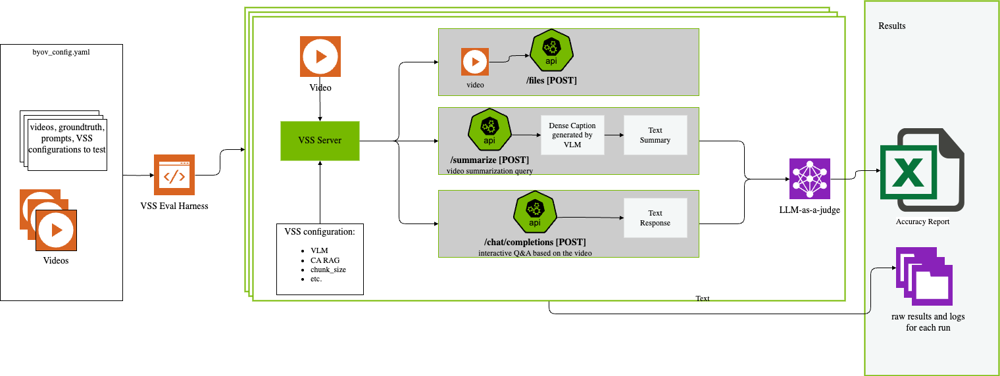
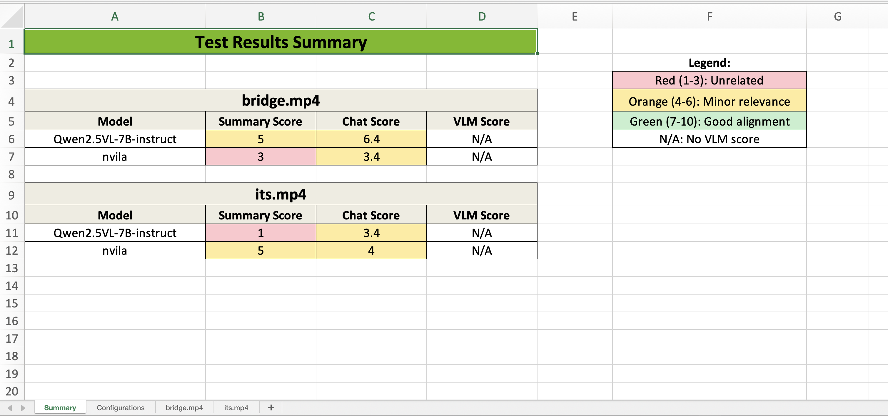
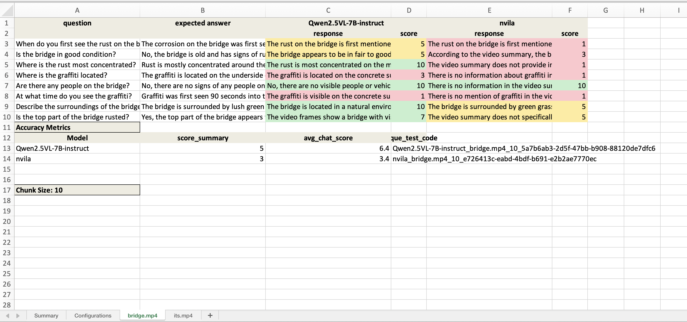

# VSS Accuracy Evaluation

VSS allows you to provide videos with corresponding ground truth files to evaluate the accuracy of VSS for your use case.
You can select the VLMs you want to use for the evaluation, including custom VLM models, as well as the usual VSS configuration options.



The evaluation is done by running the VSS pipeline on the provided videos with each configuration.
The VSS output is compared with the summary and Q&A ground truth files to calculate the accuracy metrics.
You can also provide dense caption ground truth files to evaluate the accuracy of the captions generated by the VLM.

## Configurable Parameters

| Configuration Option | Description | Where to set it |
|---------------------|-------------|-----------------|
| CA_RAG_CONFIG | Configuration for the CA-RAG model. | ca_rag_config.yaml file, select in the byov_config.yaml file. |
| DISABLE_CV_PIPELINE | Disable the CV pipeline. | byov_config.yaml file, video specific. |
| VLM_DEFAULT_NUM_FRAMES_PER_CHUNK | Number of frames per chunk for the VLM. | byov_config.yaml file. |
| GUARDRAILS_CONFIG | Path to custom guardrails config. | byov_config.yaml file. |
| DISABLE_GUARDRAILS | Enable or disable guardrails. | byov_config.yaml file. |
| VLM model | VLM model to use for the evaluation. | byov_config.yaml file. |
| VLM prompts | Prompts for the video caption, summarization, and summary aggregation. | byov_config.yaml file. |
| LLM judge model | LLM model to use to judge the accuracy of the VSS output. | byov_config.yaml file. |

## Run the Accuracy Evaluation

### Step 1: Setup the VSS Environment (Docker)

* If you have not already, clone the VSS repository, log into the NGC so all containers are accessible, and supply your NGC API Key. Steps can be found here: Deploy Using Docker Compose.

```bash
git clone https://github.com/NVIDIA-AI-Blueprints/video-search-and-summarization.git
```

```bash
docker login nvcr.io
```

```bash
Username: $oauthtoken
Password: <PASTE_API_KEY_HERE>
```

* Set the environment variables as you would for a normal run.

* Create the accuracy evaluation directory in the VSS repo.

```bash
cd src/vss-engine/
mkdir -p logs/accuracy
cd ../../eval  
```

* Edit the environment variables in the .env file.

Set the following major mandatory environment variables. You can leave others to their default values until advanced tuning becomes necessary.

| Environment Variable | Description |
|---------------------|-------------|
| NVIDIA_API_KEY | API key to access NIM endpoints. Should come from build.nvidia.com |
| OPENAI_API_KEY | API key for the remote VLM |
| NGC_API_KEY | API key to pull model from NGC |
| NVIDIA_VISIBLE_DEVICES | Select specific GPUs or all |
| MEDIA_DIRECTORY_PATH | Path to folder with videos |
| MODEL_ROOT_DIR | 5 environments provided: to add volumes that needed to be accessed inside VSS Eval Harness |

### Step 2: Create the Videos Directory

* Ensure that the videos you want to evaluate are all in one directory.
* Set the `MEDIA_DIRECTORY_PATH` environment variable to the full path of your directory containing the videos.

> **Note:** To try out the accuracy evaluation, you can use the sample videos in the `/opt/nvidia/via/streams/` directory inside VSS container.
> Use below setting for the `MEDIA_DIRECTORY_PATH` environment variable:
> 
> ```bash
> export MEDIA_DIRECTORY_PATH=/opt/nvidia/via/streams/
> ```

### Step 3: Create Ground Truth Files for Each Video

The ground truth files must be in JSON format and match the format of the example ground truth files in the `json_gts` directory.

#### Summary Ground Truth

* Edit the `summary_gt.json` file for each video.

> **Note:** An example can be found in the `eval/byov/json_gts/its_ground_truth_summary.json` file.

#### Q&A Ground Truth

* Edit the `qa_gt.json` file for each video. The questions in this file are the questions that will be asked of VSS, and the generated answers will be compared with the ground truth answers you provide in this file.

> **Note:** An example can be found in the `eval/byov/json_gts/its_ground_truth_qa.json` file.

#### Dense Caption Ground Truth

* Edit the `dc_gt.json` file for each video

> **Note:**
> * The dense caption ground truth is optional, but it is recommended to provide dense caption ground truth files to evaluate the accuracy of the captions generated by the VLM. The chunk size for the dense caption ground truth files should be the same as the chunk size set for the videos. There is an example dense caption ground truth file in the `json_gts` directory.
> 
> * An example dense caption ground truth file can be found in the `eval/byov/json_gts/warehouse_82min_ground_truth_dc.json` file.

### Step 4: Select the Configurations and Videos to Evaluate

Edit the `byov_config.yaml` file to specify the videos, ground truth file names, and the VSS configurations you want to use for the evaluation.
This is where you can also specify the VLM, guardrails, and other configurations you want to use for the evaluation.
Below are some sample byov_config.yaml files:

| byov_config.yaml file | VLMs used |
|-----------------------|-----------|
| [byov_config_sample_2.yaml](https://github.com/NVIDIA-AI-Blueprints/video-search-and-summarization/blob/main/eval/byov/byov_config_sample_2.yaml) | nvila, gpt-4o, Qwen2.5VL-7B-instruct |
| [byov_config_sample_3.yaml](https://github.com/NVIDIA-AI-Blueprints/video-search-and-summarization/blob/main/eval/byov/byov_config_sample_3.yaml) | nvila, custom |

> **Note:**
> 
> If you are using local VLMs like the nvila/CR1 models, you will need to add a line of code to allow the test to properly run. See [Local VLM Specific Instruction](#local-vlm-specific-instruction) for more details.
>
> See examples of how to set up a vLLM compatible VLM or a custom VLM for the accuracy evaluation:
> * [vLLM compatible VLM](#using-a-vllm-compatible-vlm)
> * [custom VLM](#using-a-custom-vlm)

### Step 5: Create or Upload the `ca_rag_config.yaml` File

Edit or add a `ca_rag_config.yaml` file that specifies the configuration for the CA-RAG.

An example can be found in the `eval/byov/ca_rag_config.yaml` file.

### Step 6: Ensure the Files Are in the Correct Directories

* In the VSS repo, ground truth files should be in a directory called `json_gts` in the eval directory.
* The `ca_rag_config.yaml` and `byov_config.yaml` files should be in the eval directory.

### Step 7: Run the Accuracy Evaluation

From the `eval` directory in the VSS repo, run the following commands:

* Enter the container:
    
```bash
make shell
```

* [Optional] To try out a sample configuration employing the nvila/CR1 model, you can use the following config for `byov`:

```bash
cp eval/byov/byov_config_sample_4.yaml eval/byov/byov_config.yaml
```

* [Optional] To try out a sample configuration employing the nvila/CR1 model, you also need a patch fix for the `vlm_pipeline.py` file.

More details can be found here: [Local VLM Specific Instruction](#local-vlm-specific-instruction).

* Run the accuracy evaluation:

```bash
PYTHONPATH=/:.:./eval/byov:./eval:./src  python3 -m pytest --noconftest eval/byov/test_byov.py -v -s 2>&1 | tee out.log
```

Your accuracy evaluation results will be saved in the logs/accuracy directory in the container, and in your repository.
A summary of the results will be saved in the `VSS_test_results.xlsx` file.

The sheet will look like this:




<br clear="both"/>

### Step 8: Teardown the VSS Evaluation Harness

To teardown the VSS Evaluation Harness, you can use the following command:

```bash
make down
```

## Using a vLLM Compatible VLM

To use a vLLM compatible VLM, you need to set a few variables in the byov_config.yaml file.

For example to use Qwen2.5-VL-7B-Instruct:

1. Download the model, run vLLM serve, and test the local endpoint. Follow these installation instructions: https://github.com/QwenLM/Qwen2.5-VL#installation-2 

2. Then start a OpenAI API service:

```bash
vllm serve Qwen/Qwen2.5-VL-7B-Instruct --port 38011 --host 0.0.0.0 --dtype bfloat16 --limit-mm-per-prompt image=10,video=1 --served-model-name Qwen2.5VL-7B-instruct
```

3. Then set the following variables in the byov_config.yaml file:

```yaml
VLM_Configurations:
  model: openai-compat
  model_path:
  VLM_batch_size:
  frames_per_chunk:
  VIA_VLM_OPENAI_MODEL_DEPLOYMENT_NAME: "Qwen2.5-VL-7B-Instruct"
  VIA_VLM_ENDPOINT: "http://<host>:38011/v1"
```

4. You can now add videos and any other configurations, and then run the accuracy evaluation.

## Using a Custom VLM

Make sure you have created the required files for the custom VLM. See here for an example: Custom Models. Then do the following to set it up for the accuracy evaluation:

1. Set the `MODEL_ROOT_DIR` environment variable to the path to the root directory of the custom VLM.

2. Set the `model` variable to `custom` in the byov_config.yaml file.

3. Set the `model_path` variable to the path to the custom VLM in the byov_config.yaml file.

For example, if you have a custom VLM located at `/home/user/models/custom_vlm`, you would set the following:
* environment variable: `MODEL_ROOT_DIR=/home/user/models`
* byov_config.yaml: `model_path: /home/user/models/custom_vlm`

You can now add videos and any other configurations, and then run the accuracy evaluation.

> **Note:** If you want to use multiple custom VLM models in different configurations that have different root directories, you can set additional `MODEL_ROOT_DIR_1`, `MODEL_ROOT_DIR_2`. environment variables (up to 5) and then set the `model_path` variables to the corresponding model path.

## Local VLM Specific Instruction

If you are using local VLMs like the nvila/CR1 models, you will need to add a line of code to the `vlm_pipeline.py` file to allow the accuracy evaluation to properly run. The `vlm_pipeline.py` file is located in the vlm_pipeline directory in the vss-engine directory. 

You can edit the code either inside or outside of the container. Below are instructions for one way to edit the code inside of the container.

1. From the container, run the following command to edit the stop function in the VLM pipeline file:

```bash
vim src/vlm_pipeline/vlm_pipeline.py #or vim +1529 vlm_pipeline/vlm_pipeline.py
```

2. Find the stop() function in the vlm_pipeline.py file. It should look like this:

```python
def stop(self, force=False):
  """Stop the VLM Pipeline"""
  logger.info("Stopping VLM pipeline")
  if force:
```

2. Add a line: `force = True` to the `stop()` function in the `vlm_pipeline.py` file. (Press i to enter insert mode). Verify that it is like this:
   
```python
def stop(self, force=False):
  """Stop the VLM Pipeline"""
  force=True #this is the line you need to add
  logger.info("Stopping VLM pipeline")
  if force:
```

3. Save and exit. (Press **esc**, then **:wq**, then **enter**)

## Generating the Accuracy Evaluation Report from Prior Logs

When running the VSS evaluation, the logs are saved in the logs/accuracy directory and a summary of the results is automatically saved in the VSS_test_results.xlsx file. However you can also generate the report from prior logs.

### Option 1: In the Container

To generate the accuracy evaluation report from logs in the logs/accuracy directory, you can use the following command in the container. This can be helpful if the test failed midway through and you want to generate the report from the logs that were already generated.

```bash
PYTHONPATH=/:.:./eval/byov:./eval:./src python3 eval/byov/test_byov.py excel_only
```

### Option 2: Outside of the Container

To generate the accuracy evaluation report from prior logs outside of the container, you can use the following command from the `eval` directory in the VSS repo.
These logs can be from a previous run of the VSS evaluation, just ensure that the byov_config.yaml file is the same one you used for the evaluation (otherwise ignore the configuration sheet). This command will save the report in the current directory. 

```bash
python3 scripts/get_summary_qa_results_into_xlsx.py <logs_folder_path> <byov_config_file> <output_file_name>
```

## Advanced Usage Notes

If you want to mount only the `eval` directory to the container, instead of the entire `vss-engine` directory, you can do the following:

* In the `compose.yaml` file, comment out line 33. If you want to mount the entire vss-engine directory, you can uncomment line 33 and comment out line 34.

