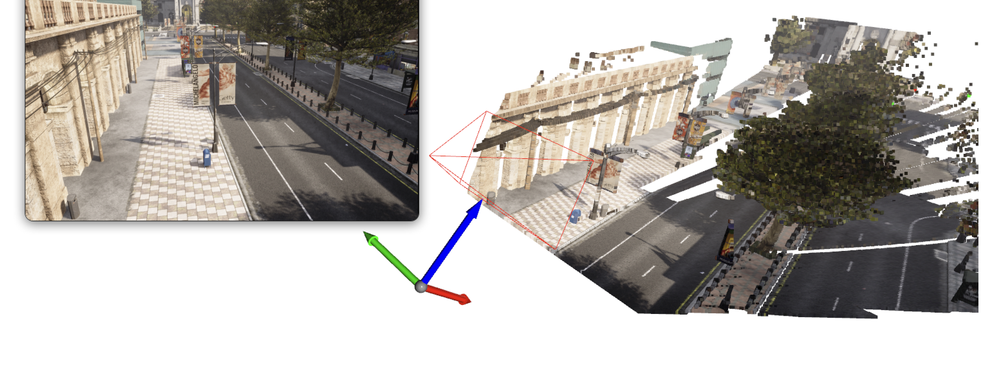

# Digital Twin-Based Camera Autocalibration Tool

This service provides an **automatic camera calibration pipeline** using the [CARLA Simulator](https://carla.org/). It creates calibration files and visualization outputs for cameras in a **digital twin environment**, leveraging semantic segmentation and depth information.



---

## Features

- Automatic camera calibration using **semantic segmentation** + **depth** from CARLA sensors.
- Extracts 2D–3D correspondences and computes **camera intrinsics & extrinsics**.
- Converts road/lane pixel locations into **geographical coordinates** (latitude/longitude).
- Generates calibration files in **MDX JSON format** for downstream applications.
- Produces **visualizations** of selected calibration points.

---

## Project Structure

```
services/dt-based-calibration/
├── Dockerfile
├── pyproject.toml
├── uv.lock
├── supervisord.conf
├── src/
│   ├── api.py                        # REST API server
│   ├── accuracy.py                   # Map accuracy tool
│   ├── autocalibration.py            # Main calibration script
│   ├── demo_web.py                   # File-upload-based calibration web UI
│   ├── manual_calibration_web.py     # Manual-assisted calibration web UI
│   ├── carla_camera_projection_demo.py
│   ├── index.html                    # ROI Simplifier web tool
│   └── utils/
│       ├── autocalibration.py        # Core calibration logic
│       ├── carla_utils.py            # CARLA operations
│       └── viz_utils.py              # 3D visualization helpers
└── data/
    ├── camera_specs.yml              # Example camera spec
    └── accuracy-sample-config.yaml   # Example accuracy config
```

---

## Running with Docker Compose

The service is distributed as a container image built and published to GHCR via the VSS GitHub pipeline. Pull the image using the shared VSS coordinate — no local build required.

From the repo root:

```bash
cd deploy/docker
docker compose \
  --env-file containers.env \
  -f services/dt-based-calibration/compose.yml \
  --profile dt-based-calibration \
  up
```

To pin a specific build:

```bash
VSS_CONTAINER_TAG=develop-<sha12> docker compose \
  --env-file containers.env \
  -f services/dt-based-calibration/compose.yml \
  --profile dt-based-calibration \
  up
```

The service requires a running CARLA server. Set `CARLA_HOST` and `CARLA_PORT` in your environment or override them in the compose invocation.

### Ports

| Port | Service |
|------|---------|
| 7865 | Calibration API |
| 8000 | Map accuracy tool |
| 7860 | File-upload calibration web UI |
| 7861 | Manual-assisted calibration web UI |
| 8080 | Main HTTP entrypoint |

Once running, open `http://localhost:7860` for the calibration web UI or `http://localhost:8000` for the map accuracy tool.

---

## Inputs

1. **Camera specification YAML** – describes cameras with position, orientation, FOV, resolution, fps and label.
   Example (`data/camera_specs.yml`):
   ```yaml
   cameras:
     - id: cam01
       position: [10, 20, 3]        # x, y, z in CARLA world coordinates (meters)
       orientation: [0, 0, 90]      # pitch, yaw, roll in degrees
       fov: 90
       resolution: [1280, 720]
       label: 1                     # CARLA segmentation label (e.g., 1 = road)
       carla_map: Town10HD
       fps: 30
       geo_position: false

     - id: cam02
       position: [37.369543551595974, -121.96537133501519, 4]
       orientation: [0, -15, 45]
       fov: 70
       resolution: [1920, 1080]
       label: 7
       carla_map: Town10HD
       fps: 30
       geo_position: true           # position given as lat/long/alt
   ```

2. **CARLA Map**
   - Use a **CARLA built-in map** (`Town03`, `Town10HD`, etc.)
   - Or provide a **custom OpenDRIVE map** (`.xodr`).

3. **CARLA server** running at `host:port` (default `carla-server:2000` inside the compose network).

---

## Outputs

For each camera:
- `cam01_calibration.mdx.json` — calibration data (intrinsic/extrinsic)
- `cam01_visualization.png` — marked calibration points
- `cam01_depth.npy` — depth map for 3D visualization

Combined files:
- `combined_calibration.mdx.json` — all cameras (MDX UI compatible)
- `combined_calibration_full.json` — all cameras with matrices (for 3D viz)

Calibration JSON structure:
```json
{
  "type": "camera",
  "id": "cam01",
  "origin": {"lng": -122.123, "lat": 37.456},
  "geoLocation": {"lng": -122.123, "lat": 37.456},
  "place": [{"name": "city", "value": "xxxx"}],
  "imageCoordinates": [{"x": 123, "y": 456}],
  "scaleFactor": 1,
  "camera_id": "cam_1",
  "globalCoordinates": [{"x": -122.123, "y": 37.456}],
  "intrinsics": [[800, 0, 640], [0, 800, 360], [0, 0, 1]],
  "coordinates": {"x": 0, "y": 0},
  "format_version": "1.0",
  "attributes": [
    {"name": "fps", "value": 30},
    {"name": "depth", "value": "depth_img"},
    {"name": "fieldOfView", "value": 90},
    {"name": "source", "value": "auto-calibration"},
    {"name": "frameWidth", "value": 1280},
    {"name": "frameHeight", "value": 720}
  ]
}
```

---

## Workflow

1. Load CARLA map (`TownXX` or custom `.xodr`).
2. Spawn semantic segmentation + depth cameras at specified positions.
3. Capture images and extract road/lane pixels.
4. Compute 2D–3D correspondences using depth & intrinsics.
5. Solve camera pose via `cv2.solvePnP`.
6. Transform to **geo-coordinates** using CARLA's API.
7. Save calibration JSON and visualizations.

---

## Notes

- Labels correspond to CARLA's segmentation classes (e.g., `1 = road`).
- Ensure your CARLA server has the **same version** as the `carla` Python API.
- The generated `.mdx.json` calibration files can be consumed by other digital twin or AV frameworks.
- Output files are written to `/app/output` inside the container, mounted from `$VSS_DATA_DIR/dt-based-calibration` on the host.

---

# Map Generator Web Interface

The accuracy tool (`http://localhost:8000`) includes a web UI that generates CARLA Digital Twin and Google Map overlays side by side.

## Using the Form

### 1. Location & Camera

| Field | Description |
|-------|-------------|
| Center Lat/Lon | Geographic center point for the map |
| Carla Z | Camera height in CARLA (default: 120) |
| Zoom | Google Maps zoom level (typical: 18–21) |
| Size | Output resolution (e.g., `1920x1080`) |
| FOV / Yaw | Camera field of view and rotation |
| Map Type | `satellite`, `roadmap`, or `hybrid` |

### 2. API & Server

| Field | Description |
|-------|-------------|
| Google API Key | Your Google Static Maps API key (required) |
| Carla Map | Map loaded in your CARLA server (e.g., `Town10HD`) |
| Host / Port | CARLA server connection (default: `carla-server:2000`) |

### 3. Coordinates

Define a path overlay as a YAML list of lat/lon pairs:
```yaml
- [37.369543, -121.965371]
- [37.369364, -121.964882]
```

## Results

Clicking **Generate Maps** produces:
1. **Digital Twin (DT):** View from the CARLA simulator.
2. **Google Map:** Corresponding real-world satellite view with path overlay.

---

# ROI Simplifier

A web-based tool (`http://localhost:8080`) to simplify complex ROI polygons from CARLA calibration files.

## Usage

1. **Load JSON** — select a calibration file
2. **Adjust Parameters** — tune Max Edge and Denoise settings
3. **Simplify** — click "Simplify ROI"
4. **Edit** (optional) — manually adjust vertices
5. **Export** — download the simplified ROI as JSON

## Parameters

| Parameter | Default | Description |
|-----------|---------|-------------|
| Max Edge | 0.045 km | Maximum edge length for concave hull. Smaller = more detailed |
| Denoise | 3.0σ | Outlier removal threshold. Smaller = more aggressive filtering |
| Adaptive | ON | Corner-aware smoothing to preserve turns while simplifying straights |

## Algorithm

```
Input Points → Denoise → Concave Hull → Simplify → Corner Smoothing → Output
```

1. **Denoise** — removes outliers beyond `threshold × σ` from the centroid.
2. **Concave Hull** — uses [Turf.js concave](https://turfjs.org/docs/#concave); falls back to convex hull if concave fails.
3. **Douglas-Peucker Simplification** — reduces point count when result exceeds 30 points.
4. **Corner-Aware Smoothing** — preserves corners (angle change >25°), removes redundant points on straight sections.

## Input Format

```json
{
  "sensors": [{
    "rois": [{
      "id": "roi-id-1",
      "roiCoordinates": [
        {"x": -121.96, "y": 37.37}
      ]
    }]
  }]
}
```

## Output Format

```json
{
  "rois": [{
    "id": "roi-1",
    "roiCoordinates": [
      {"x": -121.96543, "y": 37.36937}
    ]
  }],
  "_metadata": {
    "totalROIs": 1,
    "originalPoints": 282,
    "simplifiedPoints": 20,
    "exportedAt": "2025-12-05T..."
  }
}
```

## Dependencies

- [Turf.js](https://turfjs.org/) — geospatial analysis
- [Google Maps API](https://developers.google.com/maps) — map visualization
