<!--
SPDX-FileCopyrightText: Copyright (c) 2026 NVIDIA CORPORATION & AFFILIATES. All rights reserved.
SPDX-License-Identifier: Apache-2.0

Licensed under the Apache License, Version 2.0 (the "License");
you may not use this file except in compliance with the License.
You may obtain a copy of the License at

http://www.apache.org/licenses/LICENSE-2.0

Unless required by applicable law or agreed to in writing, software
distributed under the License is distributed on an "AS IS" BASIS,
WITHOUT WARRANTIES OR CONDITIONS OF ANY KIND, either express or implied.
See the License for the specific language governing permissions and
limitations under the License.
-->

# Docker Compose Setup

## Architecture



## Quick Setup

Run the interactive setup script to complete all prerequisites in one go:

```bash
./setup.sh
```

## Prerequisites

The setup script handles the steps below automatically. If you prefer to do them manually:

1. **Create `.env` file** with the following variables:

   ```bash
   NGC_API_KEY=<your-ngc-api-key>
   NVIDIA_API_KEY=<your-nvidia-api-key>
   LOCAL_NIM_CACHE=<path-to-nim-cache>
   HF_TOKEN=<hf-token>                  # Required for the NVFP4 (Blackwell) checkpoint and any HF model
   ASSET_BASE_URL=<base-url-hosting-perf-media>
   ARTIFACTORY_USER=<your-username>
   ARTIFACTORY_TOKEN=<your-artifactory-api-key>
   # MODEL_PATH=<override>              # Optional — usually picked automatically (see "GPU overlays" below)
   ```

2. **Set NIM cache permissions:**

   ```bash
   chown -R 1000:1000 $LOCAL_NIM_CACHE
   ```

3. **Set media download credentials** for the perf media assets:

   Point `ASSET_BASE_URL` at the host serving the perf media files, then provide credentials via environment variables:

   ```bash
   ASSET_BASE_URL=<base-url-hosting-perf-media>
   ARTIFACTORY_USER=<your-username>
   ARTIFACTORY_TOKEN=<your-artifactory-api-key>
   ```

   The media server downloader uses these to authenticate with the asset host.

4. **Create the shared media volume:**

   ```bash
   docker volume create via-media-data
   ```

   This volume is shared across all compose stacks to avoid re-downloading media files.

## Running

```bash
# Perf / benchmarking flow (most common): activate the `media` profile so
# media-server.yaml's downloader + nginx start. Without this the lvs
# container has nothing to fetch from http://media-server/<file>.
docker compose -f <compose-file>.yaml --profile media up -d
# or:
COMPOSE_PROFILES=media docker compose -f <compose-file>.yaml up -d
```

The `media` profile is opt-in to keep dev-CI integration tests (which don't read any media-server file) from blocking ~15 min on the multi-GB downloader. `compose/run_benchmark.sh` and the perf Jenkins pipeline activate it automatically; manual perf invocations need the flag explicitly.

### Remote LLM (e.g. RTX 4500, 1-GPU host with LLM hosted elsewhere)

[`x86-rtvi-cr-remote-llm_1gpu.yaml`](x86-rtvi-cr-remote-llm_1gpu.yaml) deploys LVS + RTVI-VLM (Cosmos-Reason2-8B) + Elasticsearch on a single local GPU and points LVS at an OpenAI-compatible LLM endpoint running on a separate machine. The LLM is **not** managed by this compose stack — bring your own (NIM, vLLM, or any OpenAI-compatible server).

```bash
# 1. Required env
export NGC_API_KEY=<your-ngc-key>
export REMOTE_LLM_BASE_URL=http://<llm-host>:<port>/v1            # e.g. http://10.0.0.5:9233/v1
export REMOTE_LLM_MODEL_NAME=nvidia/nvidia-nemotron-nano-9b-v2    # whatever the remote serves
export ASSET_DOWNLOAD_AUTH_TOKENS="<asset-host>=Bearer <token>"

# Optional: only if the remote LLM requires a bearer token
# export REMOTE_LLM_API_KEY=<llm-api-key>

# 2. Sanity-check the remote LLM is reachable from this host
curl -fs "$REMOTE_LLM_BASE_URL/models" | head

# 3. Launch the stack (--profile media activates the in-stack media-server
#    used by perf/benchmark URLs http://media-server/<file>)
docker compose -f compose/x86-rtvi-cr-remote-llm_1gpu.yaml --profile media up -d
docker compose -f compose/x86-rtvi-cr-remote-llm_1gpu.yaml --profile media logs -f lvs

# 4. (optional) Run the benchmark against it
./run_benchmark.sh -f x86-rtvi-cr-remote-llm_1gpu.yaml -s single_file_test

# 5. Tear down
docker compose -f compose/x86-rtvi-cr-remote-llm_1gpu.yaml down
```

`wait-for-llm` polls `${REMOTE_LLM_BASE_URL}/health/ready` (with a `/models` fallback) and blocks LVS startup until the remote endpoint is reachable, so it's safe to launch this stack before the remote LLM has finished warming up.

## Running Benchmarks

Use `run_benchmark.sh` to launch a stack, wait for health, and run the benchmark in one command. The script auto-detects your GPU and applies the matching VLM model overlay (see [GPU overlays](#gpu-overlays) below).

```bash
# Quick test (GPU overlay auto-detected)
./run_benchmark.sh -f x86-rtvi-cr-nemo3-nano_4gpu.yaml -s quick_test

# Full benchmark, tear down after
./run_benchmark.sh -f x86-rtvi-cr-nemo3-nano_4gpu.yaml -d

# Override GPU assignment and use a custom config
./run_benchmark.sh -f x86-rtvi-cr-nemo3-nano_4gpu.yaml -v 0,1 -l 2,3 -c perf_benchmark_config.yaml

# Force a specific overlay (e.g. test the B200 NVFP4 build on a mixed host)
./run_benchmark.sh -f x86-rtvi-cr-nemo3-nano_4gpu.yaml -G b200

# Skip overlay auto-detect; use base compose default
./run_benchmark.sh -f x86-rtvi-cr-nemo3-nano_4gpu.yaml -G none
```

Run `./run_benchmark.sh -h` for all options.

### Uploading Results to MinIO After Review

To inspect results locally before publishing to the dashboard, run the benchmark with `-O <name>` (writes a schema-conformant `lvs_*.json` to `../perf/benchmark/vss-perf-report/`) and skip `UPLOAD_TO_MINIO`. When ready, push with `upload_perf_results.sh`:

```bash
# Upload everything in the report dir, stamped as 'sqa'
./upload_perf_results.sh ../perf/benchmark/vss-perf-report/ -T sqa

# Or a specific file, stamped as 'perf-lab'
./upload_perf_results.sh ../perf/benchmark/vss-perf-report/lvs_*.json -T perf-lab
```

- First arg is a single `lvs_*.json` file or a directory (globs `lvs_*.json` inside).
- `-T TRIGGER` stamps `metadata.run_info.triggered_by` in each JSON before upload (`ci_pipeline | manual | scheduled | sqa | perf-lab`). Omit to keep whatever's in the file.
- Uploads to the configured MinIO `perf-results` bucket (baked-in defaults). Reuses the perf venv bootstrapped by any prior `run_benchmark.sh` run.

Run `./upload_perf_results.sh -h` for all options.

## GPU overlays

The `x86-rtvi-cr-*` compose files default `MODEL_PATH` to the **FP8** Cosmos-Reason2-8B checkpoint (most common x86 target). To run on a different device, chain a small device-specific overlay file from [`overlays/`](overlays/) after the base compose file. The merged value wins.

| Overlay | GPU | Quantization |
|---|---|---|
| `gpu-h100.yaml` | NVIDIA H100 (80 GB) | FP8 static + KV8 (~8.5 GB) |
| `gpu-h200.yaml` | NVIDIA H200 (141 GB) | FP8 static + KV8 (~8.5 GB) |
| `gpu-b200.yaml` | NVIDIA B200 | NVFP4 (~4 GB) |
| `gpu-l40s.yaml` | NVIDIA L40S | FP8 static + KV8 (~8.5 GB) |
| `gpu-thor.yaml` | Jetson Thor T5000 | NVFP4 (~4 GB) |
| `gpu-spark.yaml` | DGX Spark / GB10 | NVFP4 (~4 GB) |
| `gpu-rtx-pro-6000.yaml` | RTX Pro 6000 Blackwell Workstation | NVFP4 (~4 GB) |
| `gpu-rtx-pro-4500.yaml` | RTX Pro 4500 Blackwell | NVFP4 (~4 GB) |

`run_benchmark.sh -G` accepts: `auto` (default; match by `nvidia-smi` device name) | `none` (skip overlay, use base default) | `h100` | `h200` | `gh200` | `b200` | `gb200` | `l40s` | `thor` | `spark` | `rtx-pro-6000` | `rtx-pro-4500` | `/abs/path/to/custom.yaml`. GPUs without a device-specific overlay (A100, A40, V100, ...) fall through with no overlay applied → the base compose file's `MODEL_PATH` wins. There is no family fallback.

The `thor-*` and `spark-*` compose files ship with `MODEL_PATH` pre-set to NVFP4 — no overlay required.

Detect your GPU manually with:

```bash
nvidia-smi --query-gpu=name,compute_cap --format=csv,noheader
```

### Apply an overlay

```bash
# manual `docker compose` invocation
docker compose \
  -f compose/x86-rtvi-cr-nemo3-nano_4gpu.yaml \
  -f compose/overlays/gpu-h100.yaml \
  --profile media up -d

# or via .env (persistent)
echo 'MODEL_PATH=ngc:nim/nvidia/cosmos-reason2-8b:0303-fp4-dynamic-kv8' >> .env
docker compose -f compose/x86-rtvi-cr-nemo3-nano_4gpu.yaml --profile media up -d

# or let run_benchmark.sh pick automatically (recommended)
./run_benchmark.sh -f x86-rtvi-cr-nemo3-nano_4gpu.yaml
```

Precedence: **overlay (`-f`) > shell / `.env` > base compose default**.

## Running Multiple Benchmarks in Parallel

Each compose file has a `name:` field that automatically namespaces containers, networks, and volumes. To run two benchmarks simultaneously, use different ports (`-p`) and GPU assignments (`-v`, `-l`):

```bash
# Terminal 1 — RTVI stack on GPUs 4-7, default port 38111
./run_benchmark.sh -f x86-rtvi-cr-nemo3-nano_4gpu.yaml \
  -v 4,5 -l 6,7 -s quick_test -d

# Terminal 2 — RTVI+NIM-VLM stack on GPUs 0-3, port 39111
./run_benchmark.sh -f x86-rtvi-cr-nim-nemo3-nano_4gpu.yaml \
  -p 39111 -v 0,1 -l 2,3 -s quick_test -d
```

Each run writes results to a unique timestamped directory (e.g. `vss-perf-report-x86-rtvi-cr-nemo3-nano-4gpu-20260304-143000`), so outputs never conflict.

To manage stacks manually, pass the same `-f` flag (and `--profile media` for any operation that should also touch the media-server containers) to `docker compose`:

```bash
docker compose -f x86-rtvi-cr-nim-nemo3-nano_4gpu.yaml --profile media logs -f lvs
docker compose -f x86-rtvi-cr-nim-nemo3-nano_4gpu.yaml --profile media down
```

## Compose file reference

Choose the compose file that matches your **host topology** (single host vs separate LLM, GPU count, x86 vs ARM). The VLM checkpoint precision (FP8 / NVFP4 / BF16) is picked separately via [GPU overlays](#gpu-overlays), so a single `x86-*` compose file works on any Hopper / Ada / Blackwell / Ampere GPU.

- **RTVI** — VLM bundled inside `rtvi-vlm` (no separate VLM NIM)
- **RTVI+NIM-VLM** — `rtvi-vlm` runs in proxy mode, forwards inference to a separate Cosmos-Reason2-8B NIM

| Platform | Topology   | GPUs   | Compose file |
|----------|------------|--------|--------------|
| **x86 (Hopper / Ada / Blackwell / Ampere)** | RTVI | 2 GPU | [`x86-rtvi-cr-nemo3-nano_2gpu.yaml`](x86-rtvi-cr-nemo3-nano_2gpu.yaml) |
| **x86 (Hopper / Ada / Blackwell / Ampere)** | RTVI | 4 GPU | [`x86-rtvi-cr-nemo3-nano_4gpu.yaml`](x86-rtvi-cr-nemo3-nano_4gpu.yaml) |
| **x86 (Hopper / Ada / Blackwell / Ampere)** | RTVI | 8 GPU | [`x86-rtvi-cr-nemo3-nano_8gpu.yaml`](x86-rtvi-cr-nemo3-nano_8gpu.yaml) |
| **x86 (Hopper / Ada / Blackwell)** | RTVI | 1 GPU (Nemotron-3-Nano-30B-A3B) | [`x86-rtvi-cr-nemo3-nano_1gpu.yaml`](x86-rtvi-cr-nemo3-nano_1gpu.yaml) |
| **x86 (Hopper / Ada / Blackwell)** | RTVI | 1 GPU (Nemotron 9B) | [`x86-rtvi-cr-nemotron-9b_1gpu.yaml`](x86-rtvi-cr-nemotron-9b_1gpu.yaml) |
| **x86 (any GPU; LLM remote)** | RTVI + remote LLM | 1 GPU (VLM only) | [`x86-rtvi-cr-remote-llm_1gpu.yaml`](x86-rtvi-cr-remote-llm_1gpu.yaml) |
| **x86 (any GPU)** | RTVI+NIM-VLM | 2 GPU | [`x86-rtvi-cr-nim-nemo3-nano_2gpu.yaml`](x86-rtvi-cr-nim-nemo3-nano_2gpu.yaml) |
| **x86 (any GPU)** | RTVI+NIM-VLM | 4 GPU | [`x86-rtvi-cr-nim-nemo3-nano_4gpu.yaml`](x86-rtvi-cr-nim-nemo3-nano_4gpu.yaml) |
| **x86 (any GPU)** | RTVI+NIM-VLM | 8 GPU | [`x86-rtvi-cr-nim-nemo3-nano_8gpu.yaml`](x86-rtvi-cr-nim-nemo3-nano_8gpu.yaml) |
| **RTX Pro only** (not H100/L40S) | RTVI+NIM-VLM | 1 GPU (Nemotron 9B) | [`x86-rtvi-cr-nim-nemotron-9b_1gpu.yaml`](x86-rtvi-cr-nim-nemotron-9b_1gpu.yaml) |
| **DGX Spark** (ARM64 SBSA, Blackwell) | RTVI | 1 GPU (Nemotron 9B) | [`spark-rtvi-cr-nemotron-9b.yaml`](spark-rtvi-cr-nemotron-9b.yaml) |
| **DGX Spark** (ARM64 SBSA, Blackwell) | RTVI | 1 GPU (Nemotron-3-Nano-30B-A3B) | [`spark-rtvi-cr-nemo3-nano.yaml`](spark-rtvi-cr-nemo3-nano.yaml) |
| **Jetson Thor** (ARM64 iGPU, Blackwell) | RTVI | 1 iGPU (Nemotron 9B) | [`thor-rtvi-cr-nemotron-9b.yaml`](thor-rtvi-cr-nemotron-9b.yaml) |
| **Jetson Thor** (ARM64 iGPU, Blackwell) | RTVI | 1 iGPU (Nemotron-3-Nano-30B-A3B-NVFP4) | [`thor-rtvi-cr-nemo3-nano.yaml`](thor-rtvi-cr-nemo3-nano.yaml) |

All stacks currently ship **Cosmos-Reason2-8B**. The exact checkpoint variant is chosen by the GPU overlay:
- x86 files default to FP8 (best for H100 / H200 / GH200 / L40S); chain `overlays/gpu-b200.yaml` (B200), `overlays/gpu-gb200.yaml` (GB200), `overlays/gpu-rtx-pro-6000.yaml` (RTX Pro 6000 Blackwell Workstation), or `overlays/gpu-rtx-pro-4500.yaml` (RTX Pro 4500 Blackwell) for NVFP4. GPUs without a device-specific overlay (A100, A40, V100, ...) use the base compose default.
- Thor / Spark files default to NVFP4 (Blackwell-locked).

GPU placement in any stack can be overridden via env vars documented in each compose file's header (typically `RTVI_GPU_*`, `VLM_NIM_GPU_*`, `LLM_GPU_*`).

Supporting stacks (optional): [`media-server.yaml`](media-server.yaml) (included by default), [`otel-stack.yaml`](otel-stack.yaml) (observability).


