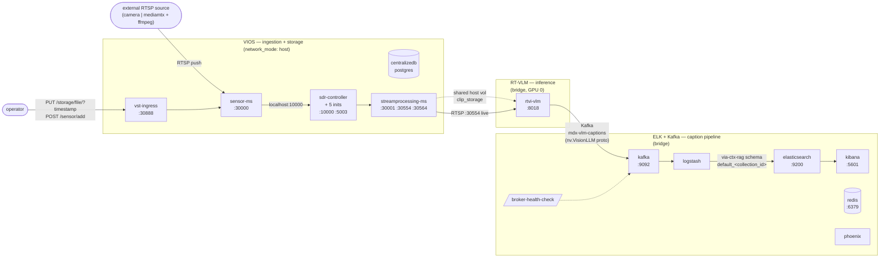

# Build Vision Agent

> Source: [NVIDIA-AI-Blueprints/video-search-and-summarization](https://github.com/NVIDIA-AI-Blueprints/video-search-and-summarization)

`build-vision-agent` is the orchestration skill that takes a natural-language capability description (and optionally an existing deployment to extend) and produces a validated Docker Compose file by reading authoritative per-microservice reference files. Use it whenever the user wants a VSS deployment composed for them — net-new profiles, extending a running stack, integrating a third-party system, or merging two profiles.

For Phase 1a (v0.1) the skill supports **IN-1 — streaming and on-demand video dense captioning**, which combines VIOS + RT-VLM + ELK. IN-2 (RT-CV + RT-DETR person detection) and the broader catalog land in subsequent phases. The skill itself does not need updates as new microservices are added — only `references/microservice-catalog.md` and the per-service `integrate-*.md` / `deploy-*.md` files.

## When to Use

- **Net-new profile**: "Create a profile for streaming and on-demand dense captioning"
- **Extension**: "Add agentic video search to my current base deployment at `./compose.yml`"
- **3P integration**: "Integrate my existing camera management system (compose at `./camera-mgmt/compose.yml`) with VSS"
- **Profile combination**: "Combine the Search Profile and Alerts Profile"
- **Helm output (post-v1)**: "Convert my dev-profile-alerts compose to a Helm chart"

If the user asks to **deploy** a generated compose, the skill will create (or update) a per-deployment deploy skill in Step 6 and prompt to invoke it in Step 8 — see those steps below. If the user asks to **call** a service's API (RT-VLM endpoints, VIOS endpoints, etc.), hand off to the relevant upstream skill (`vss-deploy-dense-captioning`, `vss-manage-video-io-storage`, `vss-setup-video-analytics-api`, etc.) — those are bundled into `<BUILD_DIR>/skills/` in Step 6.

> **`<BUILD_DIR>` convention.** All generated assets land under a single per-generation build directory chosen in Step 0. The default location is `_builds/<build-name>/` at the repository root (where `_builds/` is `.gitignore`d); the user can override at Step 0 (new under `_builds/`, overwrite an existing build folder, or supply a custom path). Throughout the rest of this document, paths written as `<BUILD_DIR>/compose.yml`, `<BUILD_DIR>/.env`, `<BUILD_DIR>/patched/`, etc. refer to file paths INSIDE that chosen directory. (Earlier revisions of this skill emitted to `skills/vss-build-vision-agent/build-output/`; any `build-output/` references that remain in prose below should be read as `<BUILD_DIR>/`.)

## How it Works

The skill executes nine steps. Steps 0–4 are read-only / interactive; steps 5–8 produce output.

```
Step 0:   Parse inputs and clarify (enumerate ALL .env files in repo)
Step 1:   Capability → microservice mapping (catalog lookup)
Step 2:   Read integrate-<microservice>.md for each candidate
Step 3:   Conflict detection (ports, shared infra, GPU contention)
Step 4:   Architecture proposal + interactive decisions (GPU, shared infra, models)
Step 5:   Read deploy-<microservice>.md for selected services
Step 6:   Generate compose artifact + bundle related skills + create/update per-deployment deploy skill
Step 6.5: Apply standalone-compose patches (insert new gating flag into patched copies + strip undefined depends_on)
Step 7:   Dry-run validation (no real unexpanded ${...} tokens — exclude $$ escapes)
Step 8:   Review + write output + prompt to deploy
```

Each step is detailed below.

### Step 0 — Parse Inputs and Clarify

Read the user's prompt. Identify:

- **Capability description** — the verb-and-noun phrase describing what the user wants (e.g., "streaming dense captioning", "person counting", "agentic search").
- **Existing deployment** (optional) — path to a Docker Compose file or Helm chart to extend or merge with. If the user provided one, parse it and inventory existing services, images, ports, volumes, and shared infrastructure.
- **Third-party descriptor** (optional) — API base URL, OpenAPI / JSON schema file path, Kafka broker address and topic list, service / DB endpoint list, message bus type. Indicates a 3P integration scenario.
- **Output target** — `compose` (default) or `helm` (post-v1; report as not-yet-supported if requested).
- **Output path (`<BUILD_DIR>`)** — captured via the interactive prompt below; do NOT silently default to a fixed path. See `#### Choose the build directory (`<BUILD_DIR>`)` immediately below for the three-option prompt and resolution rules.

#### Choose the build directory (`<BUILD_DIR>`)

All generated assets land under a single per-generation directory referred to throughout this document as `<BUILD_DIR>`. The canonical home for builds is `_builds/` at the repository root (gitignored). Before doing any other Step 0 work, list `_builds/` and prompt the user with three options:

```
Where should generated assets go?
  (a) New build folder under _builds/  [default]
  (b) Overwrite an existing build folder under _builds/
  (c) Custom path (anywhere on disk)

Existing builds under _builds/:
  - <existing-folder-1>/   (last modified <ts>, profile <flag>)
  - <existing-folder-2>/   (last modified <ts>, profile <flag>)
  (none yet)
```

Resolve based on the user's choice:

- **(a) New build under `_builds/`** (default when the user does not specify). Resolve `<BUILD_DIR> = <repo-root>/_builds/<build-name>/`. The `<build-name>` is **deferred** to Step 6, where it is derived from the invented compose-profile flag — strip the `bp_developer_` prefix and replace remaining underscores with hyphens (e.g. `bp_developer_in_1` → `in-1`, so `<BUILD_DIR> = <repo-root>/_builds/in-1/`). If a folder with that name already exists under `_builds/`, **stop and confirm with the user** — do not silently overwrite. Offer to append a suffix (`in-1-2`, `in-1-3`, ...) or to switch to option (b). In autonomous mode, auto-append the next suffix.
- **(b) Overwrite an existing build folder.** Show the list of existing `_builds/*/` folders with their last-modified timestamp and the compose-profile flag from each folder's `MANIFEST.md` (if present). Ask which to overwrite. Confirm the choice and warn that the existing contents will be replaced — note that Docker volumes and model caches (`mdx_rtvi-hf-cache`, `mdx_rtvi-ngc-model-cache`, `mdx_cosmos_reason2_8b_cache`, etc.) survive because they are managed by Docker, not bind-mounted into `<BUILD_DIR>`. Resolve `<BUILD_DIR>` to the chosen path.
- **(c) Custom path.** Accept any absolute path, or a path relative to the repository root (resolve relative paths against `<repo-root>`). Validate that the parent directory exists and is writable; refuse to write to a path inside `deploy/docker/` (would risk modifying upstream composes — see `[[build-output-self-contained]]`). If the path already exists and contains a previous build (i.e. has a `compose.yml`), confirm overwrite the same way option (b) does.

After resolving, record `<BUILD_DIR>` in the in-session context. Every subsequent step writes only inside this directory. Step 6 also writes `<BUILD_DIR>/MANIFEST.md` recording the resolution choice (which option was picked, the resolved absolute path, and the compose-profile flag) so a future re-invocation against option (b) can identify the prior generation.

> *Autonomous mode:* if the user's request says "deploy autonomously" or the skill is running in a non-interactive eval harness, **default to option (a)** and let Step 6 derive the `<build-name>` from the invented flag. Auto-append a numeric suffix on collision instead of asking.

#### Enumerate ALL `.env` files in the source repo

VSS spreads its environment configuration across **multiple `.env` files** by concern. A skill that only reads the per-profile `dev-profile-*/.env` will miss component-internal variables and produce a `.env` that fails dry-run with errors like `invalid spec: :/home/vst/vst_release/streamer_videos: empty section between colons` (caused by an unset `${CLIP_STORAGE_PATH}` collapsing the host portion of a volume mount).

Run a recursive `.env` discovery against the source repo and record every file found:

```bash
find <repo>/deploy -type f -name '.env' -not -path '*/_builds/*' -not -path '*/build-output/*' | sort
```

For the current upstream, the canonical set is **10 core `.env` files** (4 developer profiles, 1 industry profile, 5 service-internal) plus a NIM hardware-tier set selected per host architecture (see below the table):

| File | Owns variables for |
|---|---|
| `deploy/docker/developer-profiles/dev-profile-base/.env` | base profile (deployment shape, hardware, NIM placement, paths) |
| `deploy/docker/developer-profiles/dev-profile-lvs/.env` | LVS profile additions (`VLM_PORT`, `LVS_IMAGE`, `LVS_BACKEND_URL`, etc.) |
| `deploy/docker/developer-profiles/dev-profile-search/.env` | search profile additions (Kafka + ELK on, embedding service, video-analytics, etc.) |
| `deploy/docker/developer-profiles/dev-profile-alerts/.env` | alerts profile additions (alert verification, vlm-as-verifier, behavior analytics) |
| `deploy/docker/services/vios/vst.env` | **VIOS-internal vars** — `CLIP_STORAGE_PATH`, `VST_TEMP_FILES_PATH`, `SDR_IMAGE`, `ENVOY_PROXY_IMAGE`, `VST_STREAM_PROCESSOR_IMAGE`, `KAFKA_BOOTSTRAP_URL`, `REDIS_HOSTADDR`, `REDIS_PORT`, `REDIS_MSG_KEY`, `STREAM_PROCESSOR_HTTP_PORT`, `RTSP_SERVER_PORT`, `SENSOR_MODULE_ENDPOINT`, `VST_INGRESS_ENDPOINT`, `VST_INSTALL_ADDITIONAL_PACKAGES`, `MCP_GATEWAY_*` (the canonical image names live here too — `vss-vios-sensor`, not the historical `vss-vst-*`) |
| `deploy/docker/services/vios/compose-defaults.env` | Compose defaults — empty/placeholder values for variables referenced across all composes included by `deploy/docker/compose.yml`, suppressing `docker compose` warnings when a profile does not use a particular service. Override per-variable in the active profile `.env`. |
| `deploy/docker/services/video-summarization/.env` | LVS-component-internal vars (LVS image tag, backend port wiring) |
| `deploy/docker/services/rtvi/rtvi-vlm/.env` | RT-VLM-component-internal defaults |
| `deploy/docker/services/rtvi/rtvi-embed/.env` | RT-Embedding-component-internal defaults |
| `deploy/docker/industry-profiles/warehouse-operations/.env` | Industry-profile variant — `warehouse-operations` stack additions and overrides (separate from the developer-profile category) |


#### NIM hardware-tier `.env` files (new structural category)

Beyond the 10 core files above, the NIM service tree carries a **per-hardware-tier `.env` set**: one file per (model × hardware) combination, plus `-shared` variants for shared-GPU mode. Selection is by `HW_PROFILE` (set in `dev-profile-base/.env` or equivalent), not by enumeration.

Layout: `deploy/docker/services/nim/<model>/hw-<HW_PROFILE>.env` (standalone) and `hw-<HW_PROFILE>-shared.env` (shared-GPU). Plus `deploy/docker/services/nim/fallback-override.env` for cross-model overrides.

Models present upstream (as of this writing): `cosmos-reason1-7b`, `cosmos-reason2-8b`, `qwen3-vl-8b-instruct`, `gpt-oss-20b`, `llama-3.3-nemotron-super-49b-v1.5`, `nemotron-3-nano`, `nvidia-nemotron-nano-9b-v2`, `nvidia-nemotron-nano-9b-v2-fp8`.

Hardware tiers: `H100`, `RTXPRO6000BW`, `L40S`, `DGX-SPARK`, `AGX-THOR`, `IGX-THOR`, `OTHER` (not every model has every tier — `cosmos-reason1-7b` skips DGX-SPARK / Thor tiers, etc.).

**Step 0 must determine `HW_PROFILE` first**, then pick the matching NIM env file(s) for every NIM model the profile uses. Do not blindly fold all hardware-tier files into one `.env` — they contain mutually-exclusive `MODEL_PROFILE` / `LIMITS_*` values per tier and would clobber each other.

When generating the output `.env` in Step 6, **fold in every variable referenced by any selected service's compose** — even if it lives outside the per-profile `.env`. Cross-reference each candidate's `integrate-<microservice>.md` § Environment Variables for the authoritative per-service list, and walk the actual compose YAML for `${VAR}` substitutions to catch any the reference file missed.

If any of the following is unclear and the answer materially changes the architecture, **stop and ask** before proceeding:

- The capability description maps to multiple microservice candidates and the user has not narrowed it.
- The user has not said whether this is net-new or an extension of an existing deployment.
- The user wants a feature that requires a microservice not in `references/microservice-catalog.md`.

Do NOT silently fall back to a default profile when the user's intent is ambiguous.

### Step 1 — Capability → Microservice Mapping

Open `references/microservice-catalog.md`. Match the user's capability description against the **Capability tags** column. For each candidate microservice in the catalog:

- Check whether its required peer services (per its `integrate-<microservice>.md`) can be satisfied either by services already present in the user's existing deployment, or by services already in the candidate set.
- Mark the candidate as `reuse` (already in source deployment), `add` (must be brought up), or `unsatisfiable` (required peer missing and not addable from the catalog).

If a requested capability has no matching microservice in the catalog, report the gap to the user (NFR-6) and stop. Do NOT generate a partial compose with hallucinated services.

For IN-1 specifically:
- "Streaming dense captioning" → RT-VLM (carries `dense-captioning`, `streaming-inference`)
- "On-demand dense captioning" → RT-VLM (carries `on-demand-inference`)
- "Kafka publication" → covered by RT-VLM's Kafka outputs in its `integrate-rt-vlm.md`
- "Stored in Elasticsearch" → ELK (carries `caption-storage`, `kafka-ingestion`)
- "Video source" (RTSP and uploaded files) → VIOS (carries `rtsp-ingestion`, `video-upload`)

### Step 2 — Read `integrate-<microservice>.md` for Each Candidate

For each selected service, read its `integrate-<microservice>.md` from `skills/<skill-folder>/references/`. Extract:

- **Required peer services (prose)** — confirm each is satisfied (see Step 1).
- **`component_services:` block** — the structured YAML inside `§ Required Peer Services` listing the upstream compose service-keys this microservice owns. The block has two parts:
  - `always:` — service-keys unconditionally added when this microservice is selected.
  - `variants:` — named decisions (e.g., `sensor_topology`, `vlm_backend`) the skill must resolve in Step 4 before producing the per-generation allow-list. Each variant has a `prompt:`, a `default:`, and a list of `options:` (each with a `when:` hint matching user-intent shapes, plus an `add:` list of service-keys to commit if that option is picked).
- **Inputs and Outputs** — Kafka topics, REST endpoints, file paths, schema references.
- **Environment variables** — note required vs. optional and their compose-side rewrites (e.g., `RTVI_VLM_KAFKA_TOPIC` → `KAFKA_TOPIC`).
- **Network requirements** — `network_mode`, port exposures, DNS expectations.
- **Known integration constraints** — startup ordering, single-instance restrictions, schema-version pinning.

Cite the specific section you relied on for each architectural decision (NFR-5). The architecture proposal in Step 4 must reference these citations.

### Step 3 — Conflict Detection

When extending an existing deployment or merging multiple sources, detect:

- **Port conflicts** — two services bound to the same host port (especially under `network_mode: host`, where conflicts are immediate failures).
- **Duplicate infrastructure** — multiple Elasticsearch / Kafka / Redis instances. The default is to consolidate to one shared instance; deviate only when the user has explicitly asked for isolation.
- **GPU contention** — multiple GPU-reserving services sharing a single GPU when the host has only one. Flag for Step 4 decision.
- **Service-name collisions** — same `container_name` across input composes. Resolve by renaming or by treating the second as a replacement.
- **Schema mismatches** — two services agreeing on a Kafka topic name but disagreeing on payload schema (especially relevant for 3P integrations).

Surface every detected conflict in the Step 4 proposal. Do not silently resolve.

### Step 4 — Architecture Proposal and Interactive Decisions

Present a structured proposal to the user before generating any output. Required sections:

- **Services to add** (with the specific reference-file section that motivated each).
- **Services to reuse** from the existing deployment (when extending).
- **Connections to establish** — Kafka topic wirings, REST URLs, shared volume mounts, network bridges.
- **Shared infrastructure strategy** — single vs. isolated Kafka / Elasticsearch / Redis (default: shared).
- **Conflicts and proposed resolutions** from Step 3.
- **Gaps** — required peer services or interfaces that cannot be satisfied (Step 1 result).
- **Architecture diagram** — a Mermaid `flowchart` rendering the proposal visually. See the sub-section below.

#### Architecture diagram (Mermaid)

Render the proposal as a Mermaid `flowchart LR` (left-to-right) so the user can SEE the wiring, not just read it. Mermaid is text-based, displays inline in any Markdown renderer (Claude Code, GitHub, IDE extensions), and persists losslessly in `<BUILD_DIR>/MANIFEST.md` (Step 6 must embed the same diagram there for permanent reference).

The diagram MUST include:

- **One node per allow-listed service**, labeled with `<service-key><br/>:<port>` where the service exposes a host port. Group services into `subgraph` blocks by logical layer (ingestion / inference / storage / search / infra) AND annotate each subgraph with its network mode (`network_mode: host` vs. bridge) and any GPU assignment (`GPU 0`, `GPU 1`, `local_shared`).
- **One edge per connection** declared in the integrate refs' `§ Integration Interfaces`. Label each edge with the protocol + port/topic:
  - REST calls: `POST /vst/api/v1/sensor/add` etc.
  - Kafka: `mdx-vlm-captions (nv.VisionLLM proto)` (topic + schema)
  - Shared bind mounts: dashed edge labeled `shared host vol<br/>clip_storage`
  - RTSP / live media: `RTSP :30554 live` / `RTSP :30564 vod`
  - Direction: producer → consumer
- **External actors** (operator, external RTSP camera, sample RTSP source) as top-level nodes outside any subgraph, with edges INTO the deployment showing how data / requests enter.
- **Deployment shape** in the diagram title or a top-level comment (e.g. `%% deployment_shape: streaming-and-uploaded-dense-captioning`).

Canonical IN-1 example (use as a template for the shape; swap services/labels per the actual allow-list):



If the diagram exceeds ~30 nodes (combined profiles with many microservices), split it into two diagrams — one per logical sub-system (e.g. "ingestion + storage" and "inference + indexing") — and reference both from the proposal text.

Step 6 MUST embed this same diagram verbatim in `<BUILD_DIR>/MANIFEST.md § Architecture` so the operator (and any future regeneration / re-deploy) has a permanent record. Do NOT regenerate the diagram in Step 6 — copy the Step 4 output verbatim.

Then prompt the user for any of the following that are ambiguous (FR-4):

- **`component_services:` variant resolutions.** For each `variants:` block surfaced by Step 2 (schema in `references/component-services-schema.md`), present the variant's selector key (e.g. `sensor_topology`) and the list of `cases:` keys (e.g. `rtsp-and-uploaded`, `warehouse-2d`, `warehouse-3d`, `warehouse-mv3dt`). Use the user's prompt language to pre-suggest a default, then ask explicitly when the choice is non-obvious. The chosen case-name is the `deployment_shape:` written to the sidecar in the next section. Common cases:
  - VIOS `sensor_topology` — `rtsp-and-uploaded` vs. `warehouse-2d` / `warehouse-3d` / `warehouse-mv3dt`.
  - RT-VLM `vlm_backend` (when the integrate doc declares one) — in-process vs. one of the sibling NIMs.
- **GPU assignment** — which physical GPU index each GPU-requiring service should land on. Use `RT_VLM_DEVICE_ID`, `RT_CV_DEVICE_ID`, etc., names from the source compose.
- **Shared vs. isolated infrastructure** — when the user supplied a source compose with its own Kafka / ES, ask explicitly.
- **Endpoint conflicts** — when port collisions cannot be resolved automatically.
- **Model selection** — when multiple VLM / LLM options are compatible.
- **Remote vs. local inference** — for NIM-based services (RT-VLM in `openai-compat` mode, LLM NIMs).
- **External RTSP source location** (when the prompt mentions live stream input) — is the source a public RTSP server, a sibling container, or a host process? Pre-flight reachability **from inside the rtvi-vlm container** (not just the host) before generating the compose. If the source is a non-VSS sidecar, recommend co-locating on the same compose network with `--network-alias` (see `integrate-rt-vlm.md` § Network Requirements > Reaching external RTSP sources). If the source is on the host, verify Docker's iptables FORWARD chain has the necessary rule by probing `docker exec rtvi-vlm bash -c "exec 3<>/dev/tcp/${HOST_IP}/${RTSP_PORT}"`.

Wait for confirmation before continuing. The only exception is **autonomous mode** — when the user's request explicitly says "deploy autonomously" or "run without confirmation", or when running inside a non-interactive eval harness with that permission.

#### Step 4 output — per-generation allow-list sidecar (`build-output/allow-list.yml`)

Once the user confirms the architecture, synthesize a flat allow-list of upstream compose service-keys by **unioning the `component_services:` blocks** of every microservice in the proposal, **resolving each `variants:` block against the user's chosen `deployment_shape`**, and dropping any entry whose `required: false` is excluded by the architecture (e.g. an optional MQTT broker that the user opted out of).

Write the result to `build-output/allow-list.yml`. This sidecar is the **only** input Step 6.5 reads — the catalog, the per-microservice integrate files, and `SKILL.md` itself are NOT re-parsed at patch time.

Sidecar schema (defined in `references/component-services-schema.md`):

```yaml
# build-output/allow-list.yml — generated by Step 4
flag: bp_developer_in_1                              # invented per-generation in Step 6
deployment_shape: streaming-and-uploaded-dense-captioning
services:
  - key: elasticsearch
    file: services/infra/compose.yml
  - key: elasticsearch-init-container
    file: services/infra/compose.yml
  - key: kafka
    file: services/infra/compose.yml
  - key: kafka-topic-init-container
    file: services/infra/compose.yml
  - key: redis
    file: services/infra/compose.yml
  - key: kibana
    file: services/infra/compose.yml
  - key: logstash
    file: services/infra/compose.yml
  - key: broker-health-check
    file: services/infra/compose.yml
  - key: phoenix
    file: services/infra/compose.yml
  - key: centralizedb
    file: services/vios/foundational/docker-compose.yaml
  - key: vst-ingress
    file: services/vios/foundational/docker-compose.yaml
  - key: sensor-ms                                   # variant-resolved from sensor_topology=rtsp-and-uploaded
    file: services/vios/initiator/docker-compose.yaml
  - key: streamprocessing-ms                         # variant-resolved from sensor_topology=rtsp-and-uploaded
    file: services/vios/sdr/streamprocessing/docker-compose.yaml
  # SDRC stack (replaces legacy sdr-streamprocessing + envoy-streamprocessing)
  - key: init-dirs
    file: services/infra/sdrc/docker-compose.yaml
  - key: render-config
    file: services/infra/sdrc/docker-compose.yaml
  - key: wdm-env-from-config
    file: services/infra/sdrc/docker-compose.yaml
  - key: wait-for-redis
    file: services/infra/sdrc/docker-compose.yaml
  - key: wait-for-docker-workloads
    file: services/infra/sdrc/docker-compose.yaml
  - key: sdr-controller
    file: services/infra/sdrc/docker-compose.yaml
  - key: rtvi-vlm
    file: services/rtvi/rtvi-vlm/rtvi-vlm-docker-compose.yml
```

**Union rules.**

- Every top-level (non-`variants:`) entry in every confirmed microservice's `component_services:` block is contributed, unless its `required: false` is excluded by the architecture proposal.
- For each `variants:` block, exactly one `cases:` entry is contributed — the case-name matching the chosen `deployment_shape` for that variant's selector key. If no case matches, the synthesizer errors and reports the variant + the chosen shape.
- If two microservices both contribute the same `(key, file)` pair, the entry is deduplicated to one row.
- If two microservices contribute the same `key` with **different** `file:` paths, that is a catalog inconsistency — error and stop.
- `container_name` collisions are impossible by construction as long as each `variants:` block resolves to at most one service-key per `container_name`. The synthesizer does NOT need a separate dedup pass.

Persist the sidecar before invoking Step 6 (which expects the flag chosen here to be reused).

### Step 5 — Read `deploy-<microservice>.md` for Each Selected Service

For each service the user confirmed in Step 4, read its `deploy-<microservice>.md`. Extract:

- **Container image and tag pattern** — multiarch tag selection (`3.1.0` vs. `3.1.0-sbsa`) based on the host's architecture.
- **GPU requirements** — minimum VRAM, `device_ids` reservation block, `runtime: nvidia` requirement, `NVIDIA_VISIBLE_DEVICES`.
- **Storage** — required bind mounts and named volumes, with size estimates and required permissions (`chmod 777` patterns, no recursive `chown`).
- **Startup behavior** — `depends_on` conditions, healthcheck endpoint and tuning, `start_period` (especially RT-VLM's `1200s` cold-boot window).
- **Prerequisites** — NGC API key, HF token, NVIDIA Container Toolkit, free ports, outbound network requirements.

Validate that the host's GPU configuration (gathered in Step 0 if the user provided it, or queried interactively) satisfies the per-service VRAM and architecture requirements. If not, return to Step 4 to renegotiate.

### Step 6 — Generate the Compose Artifact

Write the compose file following VSS dev-profile conventions:

- **Top-level `compose.yml`** with `include:` directives pointing to per-profile subdirectories (the existing `dev-profile-base/compose.yml`, `dev-profile-search/compose.yml`, etc., pattern).
- **Environment variable substitution** for all secrets, API keys, and host-specific values. Use `${VAR_NAME}` everywhere; emit a corresponding `.env.template` in the same output directory listing every variable with comments describing purpose and required values.
- **GPU device reservations** using `deploy.resources.reservations.devices` with explicit `device_ids` from Step 4.
- **Health checks** for every service that exposes an HTTP endpoint, copied from the per-service `deploy-<microservice>.md` (do not invent — use the exact compose values).
- **`restart` policy** — match the source compose's pattern. VSS conventions: `restart: always` for persistent services, `restart: on-failure` for one-shot init containers, `restart: unless-stopped` where the source uses it.
- **`depends_on:` blocks** with explicit `condition` values from the per-service references (`service_healthy`, `service_started`, `service_completed_successfully`).
- **Compose-profile gating — invent a new flag; patch only build-output copies.** Assign the deployment a unique blueprint profile name following the catalog convention (`bp_developer_in_<N>`, `bp_developer_an_<N>`, or `bp_developer_at_<N>` per the active IN-/AN-/AT- entry in `INTEGRATION-PLAN.md` § Profile Catalog). The flag is **invented for this generation only** — it need not exist anywhere upstream, and upstream service composes are never modified. Step 6.5 copies each involved upstream compose into `build-output/patched/` and adds the new flag to every relevant service's `profiles:` list in those local copies (additive — existing upstream flags like `bp_developer_alerts_2d_vlm`, `bp_developer_search_2d`, `bp_wh_*` stay). The emitted `build-output/compose.yml` `include:`s the patched copies, so `docker compose --env-file build-output/.env -f build-output/compose.yml --profile <new-flag> up -d` deploys against the build-output tree without ever touching the upstream repo. For reference only, upstream's currently-declared flags are: developer (`bp_developer_base_2d`, `bp_developer_search_2d`, `bp_developer_alerts_2d_vlm`, `bp_developer_alerts_2d_cv`, `bp_developer_lvs_2d`, plus `*_IGX-THOR` / `*_AGX-THOR` variants) and warehouse-industry (`bp_wh_{2d,kafka,redis,auto_calib}_*`); inventing a fresh flag avoids colliding with any of them.

For Helm output (post-v1, not implemented in v0.1): generate one Deployment / StatefulSet per service, one Service manifest per service, GPU resource requests parameterized in `values.yaml`, secrets in Secret manifests, all other config in ConfigMaps, with VSS labeling conventions (`app.kubernetes.io/part-of: vss`).

#### Bundle related skills

After writing the compose artifact, copy the skill folders the operator will need to interact with this deployment into `build-output/skills/`. Scope is **only what already exists** in the VSS repo's skills folder — do NOT synthesize a new use-case skill at this step.

What to bundle:

- **Microservice skills**: for each service selected in Step 4, look up the canonical skill folder name from `references/microservice-catalog.md` and copy `<vss-repo>/skills/<skill-name>/` → `build-output/skills/<skill-name>/`. IN-1 bundles `vss-manage-video-io-storage/`, `vss-deploy-dense-captioning/`, and the ELK references (carried inside `vss-build-vision-agent/references/`).
- **Use-case skills**: scan `<vss-repo>/skills/` for top-level skill folders whose `description:` frontmatter matches the capability description from Step 0 (e.g., `streaming-dense-captioning`, `agentic-search`, `person-counting`). Copy each match. **If none match, skip — do not create one.**

Copy the entire skill folder verbatim (including `SKILL.md`, `references/`, `scripts/`, `eval/`). Do not edit any bundled file. Record every bundled skill in `MANIFEST.md` with its source path and a one-line purpose.

#### Create or update the per-deployment deploy skill

Generate a self-contained deploy skill at `build-output/skills/deploy-<profile-name>/SKILL.md` that hardcodes the exact paths and values for this deployment. The `<profile-name>` is derived from the invented flag in Step 6 by stripping the `bp_developer_` prefix and replacing any remaining underscores with hyphens: `bp_developer_in_1` → `deploy-in-1`, `bp_developer_an_1` → `deploy-an-1`, `bp_developer_at_1` → `deploy-at-1`.

The generated SKILL.md must include:

- **Compose path** — absolute or `build-output/`-relative path to the generated `compose.yml`.
- **Env file path** — path to `.env.template` and an instruction to copy it to `.env` and fill in every variable before deploy.
- **GPU assignments** — the device-id map confirmed in Step 4 (`RT_VLM_DEVICE_ID=0`, etc.), so the operator can sanity-check against the host before bring-up.
- **Per-service health endpoints + `start_period`** — copied from each `deploy-<microservice>.md`. RT-VLM's `1200s` cold-boot window must be called out explicitly.
- **Bring-up command** — the exact `docker compose --env-file build-output/.env -f build-output/compose.yml --profile <profile-name> up -d` invocation.
- **Health-check loop** — poll each service's healthcheck endpoint until pass or per-service `start_period` timeout; fail loudly with the specific service name when a check times out.
- **Tear-down command** — `docker compose --env-file build-output/.env -f build-output/compose.yml --profile <profile-name> down -v` (note: `-v` removes named volumes; warn the operator inline).
- **Post-deploy smoke test** — one curl or kafka-console-consumer command per "Outputs" section in the bundled microservice skills' `integrate-<microservice>.md`, so the operator can confirm the wiring actually works.

If a deploy skill already exists at `build-output/skills/deploy-<profile-name>/SKILL.md` (the user is regenerating the same profile), **overwrite it** with the new values. Do not append — stale GPU assignments or stale env paths from a prior run would silently misdirect deploy.

Record the generated deploy skill in `MANIFEST.md` with the bring-up and tear-down commands inline so an operator can read the manifest and execute without opening the skill.

#### Output layout after Step 6

```
build-output/
├── compose.yml
├── .env.template
├── allow-list.yml                      # Step 4 output — per-generation flag + service-key union; Step 6.5 reads this
├── MANIFEST.md
├── patched/                            # Step 6.5 outputs (compose copies with flag inserted + depends_on stripped)
└── skills/
    ├── vss-manage-video-io-storage/    # bundled from <vss-repo>/skills/vss-manage-video-io-storage/
    ├── vss-deploy-dense-captioning/    # bundled from <vss-repo>/skills/vss-deploy-dense-captioning/
    ├── <use-case-skill>/               # bundled IF one matched the capability description; skipped otherwise
    └── deploy-<flag-slug>/
        └── SKILL.md                    # generated; overwritten on re-run
```

### Step 6.5 — Apply Standalone-Compose Patches

The build-output deploys a unique, never-before-seen profile generated by the skill. To make that work against the upstream's existing compose tree **without modifying upstream files**, the skill copies the involved upstream service composes into `build-output/patched/` and applies two patches to each copy.

#### Pre-flight host preparation (Patch 0, applied at deploy time)

Before `docker compose up -d` is invoked, the generated deploy skill must run a pre-flight that addresses these gaps surfaced by live deployment on VSS 3.2:

- **Validate `.env` secrets are filled.** Refuse to deploy when `NGC_CLI_API_KEY=` or `HF_TOKEN=` are still empty/template placeholders. Cite the specific .env line; do not silently proceed (the agent's compose hangs without prompt on auth-required image pulls).
- **Create host bind-mount directories with permissions.** `mkdir -p` the following (and `chmod -R 777` the parent), or Compose fails to start ES with `failed to mount local volume … no such file or directory`:
  - `${VSS_DATA_DIR}/data_log/elastic/data`
  - `${VSS_DATA_DIR}/data_log/elastic/logs`
  - `${VSS_DATA_DIR}/data_log/kafka`
  - `${MDX_DATA_DIR}/data_log/vst/clip_storage` (for VIOS / RT-VLM shared video)
- **Clear conflicting named volumes when driver_opts have drifted.** If `mdx_mdx-elastic-data` / `mdx_mdx-elastic-logs` / `mdx_mdx-kafka` exist with bind paths different from the current `.env`, Compose prompts interactively and unattended deploys hang. Either `docker volume rm` them or pass `--yes` to `docker compose up`. The deploy skill should detect drift and surface the choice to the user before bring-up, not at it.
- **Clean up orphan containers from prior generations of the same project.** `docker compose down` only stops services in the *current* project graph — containers spawned by an earlier generation whose service set has since changed survive past teardown and continue to hold host ports / `network_mode: host` bindings. Two real failure modes seen 2026-05-26 during the SDRC rebase: (1) a legacy `vss-vios-sdr` container from a pre-rebase generation stayed `Up (healthy)` after teardown because the new IN-1 generation's allow-list no longer contains `sdr-streamprocessing`, so `down` skipped it; (2) `vss-vios-streamprocessing` from a prior generation held host port 10000, conflicting with the new `sdr-controller`'s Envoy listener and causing the new deploy to fail with `bind: address already in use`. Run `docker ps --filter "label=com.docker.compose.project=<project-name>" --format '{{.Names}}\t{{.Image}}\t{{.Status}}'` (or grep by VSS-specific container_name patterns: `vss-vios-*`, `sdr-*`, `sdrc-*`, `envoy-*`, `mdx-*`, `vss-rtvi-*`, `vss-broker-*`, `vss-elasticsearch-*`, `vss-kafka-*`, `mediamtx`, `ffmpeg-push`) before `up -d`. If any are present and are NOT in the current allow-list's expected container_name set, surface the list to the user and offer to `docker rm -f` them. Do not silently proceed — the deploy will fail with cryptic port-conflict errors otherwise.
- **NGC login to `/root/.docker/config.json`.** `echo "$NGC_CLI_API_KEY" | sudo docker login nvcr.io -u '$oauthtoken' --password-stdin` — write to root's docker config (the agent learned this; `sudo --preserve-env=DOCKER_CONFIG` deadlocks on futex).
- **Verify the chosen profile flag isn't already in use** by any project on the host (`docker compose ls`). If `mdx` (or whichever project name) is already deployed, surface the conflict; teardown requires explicit user authorization.

#### Patch 1 — Insert the new gating flag (allow-list-driven)

Add the invented flag (chosen in Step 6's compose-profile gating bullet — e.g., `bp_developer_in_1`) to **only the `(key, file)` pairs listed in `build-output/allow-list.yml` under `services:`** (the sidecar generated by Step 4). The flag is **additive** — upstream flags already in each `profiles:` list (`bp_developer_alerts_2d_vlm`, `bp_developer_search_2d`, `bp_wh_*`, etc.) stay. Services NOT in the allow-list keep their upstream `profiles:` list byte-identical to upstream and are naturally excluded when the deploy runs with `--profile bp_developer_<flag>`.

Each sidecar entry is patched at exactly one site, so `PATCHES.md` records `len(sidecar.services)` added flag-sites in total. Note: a single upstream file may contain several allow-listed services (e.g. `services/vios/sdr/streamprocessing/docker-compose.yaml` contributes `streamprocessing-ms`, `sdr-streamprocessing`, and `envoy-streamprocessing` to IN-1 — three sites in one file).

> **Why an allow-list, not "patch every site then exclude"?** The patch-everything-then-exclude model was architecturally wrong: it (a) coupled every generation to whichever upstream flag (`bp_developer_base_2d`) was most-commonly co-listed in the patched files, inheriting services the user did not ask for; (b) required an ever-growing `EXCLUDE_SERVICES` set for sibling services that happened to share a file with a wanted service (e.g. `sensor-bp-wait-bp-configurator` sharing `initiator/docker-compose.yaml` with `sensor-ms`); (c) triggered `container_name` collisions when sibling services upstream share a `container_name` (`vss-vios-sensor` is used by `sensor-ms`, `sensor-ms-2d`, `sensor-ms-3d`, `sensor-ms-mv3dt`); patching all four caused Compose to refuse the project until a dedup pass was added. The allow-list eliminates all three problems by construction — Step 4's variant resolution explicitly picks one sibling-variant per container_name, the wait-container is simply not contributed by any microservice's `component_services:`, and there is no exclude list to grow.

> **VIOS + SDRC stack (mandatory; SDRC rebase 2026-05-26):** VIOS's `component_services:` block declares the SDRC-routed Topology A stack across (a) per-shape sensor-ms + streamprocessing-ms variants resolved by `sensor_topology`, and (b) six top-level SDRC entries that apply to every shape: `init-dirs`, `render-config`, `wdm-env-from-config`, `wait-for-redis`, `wait-for-docker-workloads`, `sdr-controller` (all in `services/infra/sdrc/docker-compose.yaml`). A common bug is to think only `streamprocessing-ms` is needed because its name visibly mentions "streamprocessing" — but `sensor-ms` calls the SDRC-rendered Envoy listener on `localhost:10000` for every sensor-add, and without the full SDRC stack running, `POST /sensor/add` fails with `Invalid Parameters`. The legacy `sdr-streamprocessing` + `envoy-streamprocessing` pair (still in the source tree at `services/vios/sdr/streamprocessing/docker-compose.yaml`) is **gated to a dead profile** in `develop` and must NOT be contributed by any `component_services:` block — adding it back will surface as duplicate-port-10000 conflicts or duplicate Envoy listener errors at deploy time. Do not edit the integrate-vios-service.md component_services block without re-reading § Required Peer Services + § Known Integration Constraints.

Record the chosen flag at the top of `build-output/MANIFEST.md` and use it in every bring-up / tear-down command surfaced to the user.

##### Patch 1 — Implementation reference (works without `yq`)

```python
# pseudocode
import yaml
from pathlib import Path

sidecar = yaml.safe_load(Path("build-output/allow-list.yml").read_text())
flag = sidecar["flag"]                                       # e.g. "bp_developer_in_1"
# (key, file) tuples — each entry pinpoints exactly one upstream service in exactly one file
allow_entries = [(e["key"], e["file"]) for e in sidecar["services"]]

for key, rel_file in allow_entries:
    patched = Path("build-output/patched") / rel_file
    # locate the service block; handle both inline and block-style profiles:
    services = parse_compose_services(patched)   # returns {key: (start_line, end_line)}
    start, end = services[key]
    patch_profiles_in_service(patched, start, end, flag)
```

Both inline (`profiles: [a, b]`) and block-style (`profiles:\n  - a\n  - b`) lists must be handled — upstream uses both freely (e.g., `streamprocessing-ms` is inline; `sensor-ms` is block-style). Insert the new flag preserving the file's existing format.

#### Patch 2 — Strip undefined `depends_on` entries

Recent Docker Compose (≥ v2.36) validates the entire compose project at load time and **rejects `depends_on` references to services that are not defined within the same project**, even when those references carry `required: false`. `--no-deps` does NOT bypass this validation. The full VSS `deploy/docker/compose.yml` works because it `include:`s every sibling compose and therefore every `depends_on` target resolves. A *standalone* compose generated by this skill — one that includes only the subset needed for a focused generation — does not have that property and will fail with errors like:

```
service "rtvi-vlm" depends on undefined service "cosmos-reason1-7b": invalid compose project
```

The patch is generalized across **every** allow-listed service (not RT-VLM only), driven by `build-output/allow-list.yml`.

**Detection.** For each `(key, file)` pair under `services:` in `build-output/allow-list.yml`, locate the named service in its patched compose file and:

1. Walk its `depends_on:` block.
2. For each peer key, look up whether the peer is **defined** (has a `services:` entry) anywhere in the patched compose tree (walk the `include:` graph rooted at `build-output/compose.yml`).
3. Classify:
   - **Defined peer (in allow-list or not)** → entry stays. Compose evaluates the dependency against the active project graph at deploy time and skips it cleanly if the peer is not in any active profile.
   - **Undefined peer with `required: false`** → strip the entry. The upstream author already said "this dependency is optional"; the skill respects that and removes the unresolvable reference.
   - **Undefined peer WITHOUT `required: false`** → **error and stop**. The allow-list is inconsistent with the upstream compose — the allow-listed service genuinely needs this peer to start, and the operator must reconcile by (a) re-running Step 4 with a different variant choice that contributes the peer, or (b) accepting that the deployment cannot ship. Surface the gap; do not silently strip.

```bash
# pseudocode
for compose in build-output/patched/**/*.{yml,yaml} build-output/compose.yml; do
  scan compose for services: → set of defined service keys
done
defined_keys = union across the include graph

for each key in allow-list.yml:
  locate its block in the patched tree
  for each entry in its depends_on:
    if entry.target in defined_keys:
      keep
    elif entry.required is False:
      strip
    else:
      raise AllowListInconsistencyError(key, entry.target)
# (driven entirely by sidecar.services — never re-parses integrate-*.md or the catalog)
```

For the IN-1 generation, the per-allow-listed-service behavior:

- **rtvi-vlm**: declares `depends_on` on `cosmos-reason1-7b`, `cosmos-reason1-7b-shared-gpu`, `cosmos-reason2-8b`, `cosmos-reason2-8b-shared-gpu`, `qwen3-vl-8b-instruct`, `qwen3-vl-8b-instruct-shared-gpu`, and `broker-health-check` — all with `required: false`. The six NIM peers are undefined in the IN-1 patched tree (the `vlm_backend` variant resolved to `in_process`, so no `nim/...` composes are included) → all six stripped. `broker-health-check` is defined in `services/infra/compose.yml` (contributed by ELK's `always:` list) → entry stays.
- **sensor-ms**: declares `depends_on` on `centralizedb`, `sensor-bp-wait-bp-configurator (required: false)`, `sdr-streamprocessing (required: false)`, `envoy-streamprocessing (required: false)`, `sdr-controller (required: false)`. In a Topology A / SDRC-routed IN-1, `centralizedb`, `sensor-bp-wait-bp-configurator`, and `sdr-controller` are all defined in the patched include graph → those entries stay. The legacy `sdr-streamprocessing` and `envoy-streamprocessing` services live only in the deprecated `services/vios/sdr/streamprocessing/docker-compose.yaml` (gated to a dead profile in `develop` after the SDRC rebase) and are NOT contributed by the SDRC `component_services:` block, so they are undefined in the allow-listed include graph → both stripped per the `required: false` rule.
- **sdr-controller**: declares `depends_on` on `broker-health-check (required: false)`, `init-dirs`, `render-config`. `broker-health-check` is contributed by ELK (defined); `init-dirs` and `render-config` are contributed by VIOS's SDRC entries (defined) → no entries stripped.
- **wdm-env-from-config**, **wait-for-redis**, **wait-for-docker-workloads**: each depends on one or more of `init-dirs` / `render-config` / `wdm-env-from-config` → all defined in the same file → no strips.
- **vst-ingress**, **streamprocessing-ms**, **centralizedb**, **logstash**, **kibana**, **elasticsearch**, **kafka**, **redis**, **broker-health-check**, **phoenix**, **init-dirs**, **render-config**: all `depends_on` peers (where present) are defined in the include graph → no strips needed.

After applying any strips, **note in `MANIFEST.md`** which `depends_on` entries were stripped from which service in which file, so the operator understands the difference between the patched copy and the upstream original.

#### Patch 3 — Materialize relative-path bind-mount source files

When a patched compose copy declares a bind mount with a **relative source path** (e.g., `./envoy.yaml:/etc/envoy/envoy.yaml`, `./sdr-config:/wdm-configs`, `./configs/kafka:/etc/kafka/configs`), Docker resolves that source against **the directory containing the compose file**. In the patched tree under `build-output/patched/`, that directory is freshly created and contains ONLY the patched YAML — none of the sibling files the upstream tree had. When the operator runs `docker compose up`, Docker tries to bind-mount a non-existent host path and **silently creates it as an empty directory** (owned by root, typically with mode 0755). The container then:

- For a single-file mount (`./envoy.yaml`): the container sees `/etc/envoy/envoy.yaml` as a directory, the application fails to read it as a file, and the container exits with an obscure error (Envoy prints its usage banner; nginx complains about syntax; etc.).
- For a directory mount (`./sdr-config`): the container sees `/wdm-configs/` as empty, and SDR logs `Cluster config file (/wdm-configs/docker_cluster_config.json) does not exist` before falling into a degraded mode that may or may not crash.

**Fix.** After Patch 1 and Patch 2 are applied, walk every patched compose's `volumes:` list, identify relative-path sources (any path that doesn't start with `/` or `${VAR}/` and doesn't match a named volume), resolve them against the upstream compose's directory, and `cp -r` the source file or directory into the patched compose's directory.

```python
# pseudocode
import re, shutil
from pathlib import Path

for patched in Path("build-output/patched").rglob("*.y*ml"):
    text = patched.read_text()
    # Find every volumes: line referencing a relative source
    for m in re.finditer(r"-\s*([^:\s/${][^:\s]*):/", text):
        rel = m.group(1)               # e.g., "./envoy.yaml" or "envoy.yaml"
        upstream_dir = REPO / patched.relative_to("build-output/patched").parent
        upstream_src = (upstream_dir / rel).resolve()
        patched_dst  = (patched.parent / rel).resolve()
        if upstream_src.exists() and not patched_dst.exists():
            if upstream_src.is_file():
                patched_dst.parent.mkdir(parents=True, exist_ok=True)
                shutil.copy2(upstream_src, patched_dst)
            else:
                shutil.copytree(upstream_src, patched_dst)
            print(f"materialized {rel} from {upstream_src} → {patched_dst}")
```

The canonical case is the VIOS SDR/Envoy pair: `services/vios/sdr/streamprocessing/docker-compose.yaml` declares `./envoy.yaml:/etc/envoy/envoy.yaml` (a file) and `./sdr-config:/wdm-configs` (a directory containing `docker_cluster_config.json` + `data_wl.yaml`). Both must be copied into `build-output/patched/services/vios/sdr/streamprocessing/` alongside the patched YAML. Without this, the IN-1 (or any Topology A) deployment fails on bring-up. Source: live verification 2026-05-23 with the IN-1 build-output.

##### Patch 3 sub-case — SDRC config templates (`config.yml.tmpl` + `docker_cluster_config-streamprocessing.json.tmpl`)

SDRC's `render-config` init container mounts an **env-var-resolved** host directory into `/tmpl` (`${SDR_CONTROLLER_CONFIG_PATH:-"./configs"}/configs:/tmpl`) and iterates `*.tmpl` files inside it, substituting `${HOST_IP}` / `${NUM_STREAMS}` / `${NUM_SENSORS}` in place. The general Patch 3 walk above only catches **relative-path** sources — an env-driven path is not matched. When `sdr-controller` is in the allow-list, the skill must additionally:

1. Resolve a build-output-local `SDR_CONTROLLER_CONFIG_PATH` (default: `<BUILD_DIR>/sdrc/configs`).
2. Create `<BUILD_DIR>/sdrc/configs/configs/` (note: the SDRC compose mounts `${SDR_CONTROLLER_CONFIG_PATH}/configs` — so the templates live in a *nested* `configs/` directory).
3. Copy two templates from upstream:
   - `deploy/docker/developer-profiles/dev-profile-alerts/sdrc/2d_vlm/configs/config.yml.tmpl` → `<BUILD_DIR>/sdrc/configs/configs/config.yml.tmpl`
   - `deploy/docker/developer-profiles/dev-profile-alerts/sdrc/2d_vlm/configs/docker_cluster_config-streamprocessing.json.tmpl` → `<BUILD_DIR>/sdrc/configs/configs/docker_cluster_config-streamprocessing.json.tmpl`
4. Write `SDR_CONTROLLER_CONFIG_PATH=<BUILD_DIR>/sdrc/configs` (absolute path) into `<BUILD_DIR>/.env` so the SDRC compose's bind mount resolves correctly.

These templates model the **single-workload SDRC form** (one `streamprocessing-ms` workload — no `rtvi-cv` sibling). They are upstream-byte-identical — do NOT hand-edit; `render-config` substitutes the runtime values from the build-output `.env`.

Without this materialization, `sdrc-render-config` exits with `render-config: no *.tmpl files found in /tmpl`, the whole SDRC chain stalls, `sdr-controller` never boots, and `POST /sensor/add` fails with `InvalidParameterError: Invalid Parameters` because the SDRC-rendered Envoy listener on `localhost:10000` is absent. Source: live verification, IN-1 SDRC rebase 2026-05-26.

Add a row to `PATCHES.md` for every file/directory materialized, citing the upstream source path and the patched destination, so the operator can audit.

### Step 7 — Dry-Run Validation

After writing, validate before declaring success. The dry-run command depends on whether the source repo splits env vars across multiple files (Step 0):

```bash
# If single combined env produced in Step 6:
docker compose --env-file .env -f compose.yml config > resolved.yml

# If layering multiple env files (preferred when component .envs are kept separate):
docker compose --env-file .env --env-file <repo>/deploy/docker/services/vios/vst.env \
  -f compose.yml config > resolved.yml
```

Then check there are no **real** unexpanded `${...}` tokens. Compose intentionally preserves `$${...}` (double-dollar) — these are escape sequences that pass `${...}` through to the container's shell at runtime — so a naive `grep '\${'` produces false positives. Match `${` only when **not** preceded by another `$`:

```bash
# Real unexpanded tokens: ${...} not preceded by another $
if grep -nE '(^|[^$])\${[A-Za-z_]' resolved.yml; then
  echo "FAIL: resolved.yml has real unexpanded variables (above)"
  exit 1
fi
echo "PASS — no real unexpanded tokens"
```

Real unexpanded tokens indicate either a missing env entry or a typo. Either fix the `.env` and regenerate, or surface the gap to the user — do not hand-edit `resolved.yml`.

For Helm output (post-v1): run `helm lint` instead.

### Step 8 — Review, Write Output, and Prompt to Deploy

Present a summary of the generated artifact:

- File paths written
- Service list with images and assigned ports
- GPU assignments
- Shared infrastructure decisions
- `.env.template` location and the variables the user must fill in
- Bundled skills (microservice + use-case, from Step 6)
- Generated per-deployment deploy skill (`deploy-<profile-name>`, from Step 6) with its bring-up command

Show the diff if the operation modified an existing deployment. Wait for user confirmation, then write all files to the output directory. Always emit a `MANIFEST.md` listing every generated file and its purpose. The manifest must include an `## Architecture` section embedding the Mermaid `flowchart LR` produced in Step 4 verbatim — operators reading the manifest should see the wiring at a glance, without re-running the skill.

#### Prompt to deploy

After all files are written, ask the user explicitly:

> "Deploy this profile now? [y/N]"

- **If `y`**: invoke the `deploy-<profile-name>` skill generated in Step 6. The skill should run from `build-output/` as its working directory so it picks up the generated `compose.yml`, `.env`, and `MANIFEST.md`. Before invoking, confirm the user has copied `.env.template` to `.env` and filled in required values (NGC API key, HF token, host IP, GPU IDs) — if `.env` is missing or still contains template placeholders, stop and ask the user to fill them in.
- **If `n` or no response**: print the bring-up command and the skill invocation command so the user can run either later:
  ```
  # Direct compose:
  docker compose --env-file build-output/.env -f build-output/compose.yml --profile <profile-name> up -d

  # Or via the generated skill:
  /deploy-<profile-name>
  ```

The autonomous-mode exception from Step 4 applies here too: when the user's original request explicitly said "deploy autonomously" or "and deploy", treat as `y` without prompting. When running in a non-interactive eval harness without explicit deploy intent, treat as `n` and just print the commands.

## File Structure

```
skills/vss-build-vision-agent/
├── SKILL.md
├── CONTRIBUTING.md                                    # (planned) how to add a new microservice (see Phase 0 deliverables)
├── eval/
│   ├── in-1-streaming-dense-captioning.json      # priority eval — gates Phase 4 rollout
│   ├── in-2-person-detection-rt-detr.json        # priority eval — extensibility test
│   └── ...                                            # follow-on evals as Phase 1c services land
├── references/
│   ├── integrate-microservice-schema.md               # canonical schema for integrate-<microservice>.md
│   ├── deploy-microservice-schema.md                  # canonical schema for deploy-<microservice>.md
│   ├── microservice-catalog.md                        # index: capability tags → service → reference paths
│   ├── vss-compose-patterns.md                        # (planned) include-based compose, env_overrides, dry-run
│   ├── vss-helm-patterns.md                           # (planned, post-v1)
│   ├── shared-infrastructure.md                       # (planned) Kafka / ES / Redis sharing decision tree
│   └── gpu-allocation.md                              # (planned) device_ids, count, per-service vs. shared
└── scripts/
    └── validate-references.py                         # discovers and validates every integrate-*.md / deploy-*.md
```

## IN-1 Walkthrough — Concrete Example

User prompt:
> "Create a profile for streaming and on-demand video dense captioning. Streamed dense captions should be published to the kafka message bus and stored in elasticsearch."

Skill execution:

1. **Step 0 — Parse**: capability = "streaming + on-demand dense captioning, Kafka + ES storage". No existing deployment, no 3P descriptor. Output target = compose (default). Net-new.

2. **Step 1 — Catalog**: tag-match against `microservice-catalog.md`. Candidates: RT-VLM (`dense-captioning`, `streaming-inference`, `on-demand-inference`), VIOS (`rtsp-ingestion`, `video-upload`), ELK (`caption-storage`, `kafka-ingestion`). All required peers satisfiable from within the candidate set plus `kafka` from the foundational stack.

3. **Step 2 — Read integrate refs**: `integrate-rt-vlm.md`, `integrate-vios-service.md`, `integrate-elk.md`. Note: RT-VLM's `clip_storage` mount must be the same host path as VIOS's `${VST_VIDEO_STORAGE_PATH}`. RT-VLM publishes to `${RTVI_VLM_KAFKA_TOPIC}`. **VSS 3.2 ships with two Logstash pipelines** at `deploy/docker/services/infra/elk/logstash/pipelines/kafka/`: `mdx-logstash.conf` subscribes to `mdx-vlm-incidents` + `mdx-vlm-alerts` (alert path); `mdx-lvs-logstash.conf` subscribes to `mdx-vlm-captions` + `mdx-structured-events-summary` (caption path → indexes via via-ctx-rag schema). **For plain captions to reach ES, the skill must set `RTVI_VLM_KAFKA_TOPIC=mdx-vlm-captions`** — the raw compose default `vision-llm-messages` and the pre-3.2 legacy `mdx-vlm` are both unsubscribed.

4. **Step 3 — Conflicts**: none for net-new. Note that VIOS uses `network_mode: host` while RT-VLM uses default bridge — wiring crosses through `${HOST_IP}:9092` for Kafka and a shared volume for video.

5. **Step 4 — Proposal**:
   - Services to add: VIOS (4 containers), RT-VLM (1 container + sibling NIM), ELK (4 containers), Kafka (foundational), Redis (foundational), `broker-health-check`.
   - Sibling VLM NIM choice: `cosmos-reason2-8b` by default. Confirm or ask.
   - GPU assignment: RT-VLM on GPU 0; sibling NIM on GPU 0 (`local_shared`) or GPU 1 (`local`). Ask.
   - Shared ES: single instance (default).
   - Caption topic: emit `RTVI_VLM_KAFKA_TOPIC=mdx-vlm-captions` (the VSS-3.2 upstream-subscribed topic). Do NOT use the raw compose default `vision-llm-messages` (unsubscribed) or the pre-3.2 `mdx-vlm` (also unsubscribed). Caption docs will land in ES indices named `<collection>_<id>` per the via-ctx-rag schema, not in `mdx-vlm-*` date indices.

6. **Step 5 — Read deploy refs**: `deploy-rt-vlm.md`, `deploy-vios-service.md`, `deploy-elk.md`. Validate host has GPU with ≥ 16 GB VRAM for the cosmos-reason2-8b backend.

7. **Step 6 — Generate**: write `<BUILD_DIR>/compose.yml` plus per-service includes, `.env.template`, `MANIFEST.md`, and `<BUILD_DIR>/allow-list.yml` (the per-generation union from Step 4). Invent a fresh flag (e.g. `bp_developer_in_1`) and record it under `flag:` in `allow-list.yml`; pass it as `--profile <flag>` at deploy time. Step 6.5 will copy the upstream `rtvi-vlm`, VIOS, **SDRC** (`services/infra/sdrc/docker-compose.yaml`), and foundational ELK/Kafka composes into `<BUILD_DIR>/patched/` and add the flag to every service-key in `allow-list.yml`; every other service in those files stays unmodified, and upstream files stay untouched. Patch 3 additionally materializes the SDRC config templates (`config.yml.tmpl` + `docker_cluster_config-streamprocessing.json.tmpl`) under `<BUILD_DIR>/sdrc/configs/configs/` (sourced from `developer-profiles/dev-profile-alerts/sdrc/2d_vlm/configs/`) and sets `SDR_CONTROLLER_CONFIG_PATH=<BUILD_DIR>/sdrc/configs` in the build-output `.env` so the SDRC chain can render. Bundle the `vss-manage-video-io-storage/` and `vss-deploy-dense-captioning/` skills from `<vss-repo>/skills/` into `build-output/skills/` (ELK references already live inside `vss-build-vision-agent/references/`). Scan `<vss-repo>/skills/` for a use-case skill matching "streaming dense captioning" and bundle if present, otherwise skip. Generate `build-output/skills/deploy-<flag-slug>/SKILL.md` with the exact compose path, env path, RT-VLM `1200s` cold-boot window, GPU assignment, healthcheck loop, and bring-up / tear-down commands hardcoded.

8. **Step 7 — Dry-run**: `docker compose --env-file .env.template config > resolved.yml` and confirm no `${...}` remain.

9. **Step 8 — Review and prompt to deploy**: present summary including bundled skills and the generated `deploy-in-1` skill; on confirmation, write to `./build-output/`. Then ask "Deploy this profile now? [y/N]" — on `y`, verify `.env` is filled in and invoke `deploy-in-1`; on `n`, print the bring-up command.

## Operating Principles

- **Reference files are the source of truth.** Never hallucinate a service's image, port, env var, or peer dependency. If the reference file does not say it, do not generate it.
- **Cite specific sections.** Every architectural decision must point to the reference file and section that motivated it (NFR-5).
- **Surface gaps, do not paper over them.** A missing reference file is a stop condition, not a "best-effort" trigger (NFR-6). The catalog determines what the skill can compose.
- **Prompt for ambiguous decisions.** GPU assignment, shared infra, model selection, remote vs. local inference — all explicit user choices, not silent defaults (FR-4).
- **Idempotency.** Running the skill twice on the same input must produce the same output (NFR-3). The output compose must support `docker compose up` twice without error.
- **No silent modification.** When extending an existing deployment, every change to a pre-existing service must surface in the architecture proposal and diff (NFR-2).
- **Secrets via env substitution only.** No plaintext credentials in generated files (NFR-4). The `.env.template` lists every variable; values are the user's responsibility.

## Tear Down

`build-vision-agent` does not bring services up or down itself — that is the per-deployment `deploy-<profile-name>` skill generated in Step 6. Tear down a running profile with its skill (which knows the right `--profile` gate and volume cleanup):

```
/deploy-<profile-name>            # bring up
/deploy-<profile-name> down       # tear down (or use the explicit command in MANIFEST.md)
```

To remove the generated build artifacts themselves (compose, bundled skills, generated deploy skill):

```bash
rm -rf ./build-output/
```

## References

- `references/microservice-catalog.md` — index of all VSS microservices with reference files
- `references/integrate-microservice-schema.md` — canonical integration-contract schema
- `references/deploy-microservice-schema.md` — canonical deployment-contract schema
- Per-deployment deploy skills are generated by Step 6 at `build-output/skills/deploy-<profile-name>/SKILL.md` — no shared `/deploy` skill exists.
- VSS docs: <https://docs.nvidia.com/vss/latest/>
- agentskills.io spec: governs the `name` / `description` / `version` / `license` frontmatter at the top of this file.
