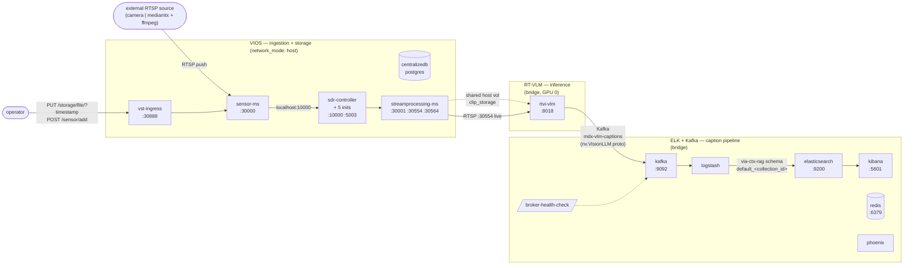

# Architecture Diagram Template (Step 4)

Render the architecture proposal as a Mermaid `flowchart LR` (left-to-right) so the user can SEE the wiring, not just read it. Mermaid is text-based, displays inline in any Markdown renderer (Claude Code, GitHub, IDE extensions), and persists losslessly in `<BUILD_DIR>/MANIFEST.md` — Step 6 must embed the same diagram there for permanent reference.

## Required content

The diagram MUST include:

- **One node per allow-listed service**, labeled with `<service-key> :<port>` where the service exposes a host port. Group services into `subgraph` blocks by logical layer (ingestion / inference / storage / search / infra) AND annotate each subgraph with its network mode (`network_mode: host` vs. bridge) and any GPU assignment (`GPU 0`, `GPU 1`, `local_shared`).
- **One edge per connection** declared in the integrate refs' `§ Integration Interfaces`. Label each edge with the protocol + port/topic:
  - REST calls: `POST /vst/api/v1/sensor/add` etc.
  - Kafka: `mdx-vlm-captions (nv.VisionLLM proto)` (topic + schema)
  - Shared bind mounts: dashed edge labeled `shared host vol clip_storage`
  - RTSP / live media: `RTSP :30554 live` / `RTSP :30564 vod`
  - Direction: producer → consumer
- **External actors** (operator, external RTSP camera, sample RTSP source) as top-level nodes outside any subgraph, with edges INTO the deployment showing how data / requests enter.
- **Deployment shape** in the diagram title or a top-level comment (e.g. `%% deployment_shape: streaming-and-uploaded-dense-captioning`).

If the diagram exceeds ~30 nodes (combined profiles with many microservices), split it into two diagrams — one per logical sub-system (e.g. "ingestion + storage" and "inference + indexing") — and reference both from the proposal text.

Step 6 MUST embed this same diagram verbatim in `<BUILD_DIR>/MANIFEST.md § Architecture` so the operator (and any future regeneration / re-deploy) has a permanent record. Do NOT regenerate the diagram in Step 6 — copy the Step 4 output verbatim.

## Canonical IN-1 example

Use as a template for the shape; swap services/labels per the actual allow-list:

